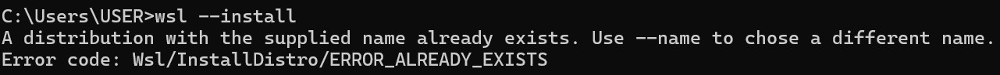
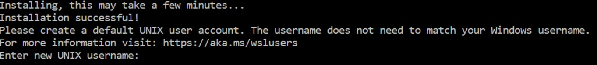
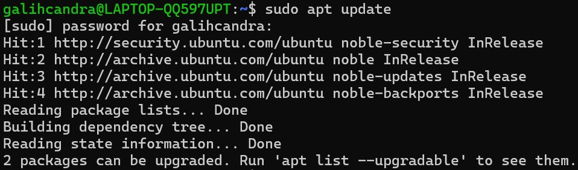
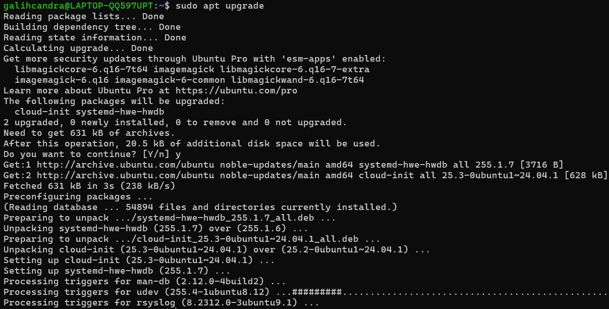
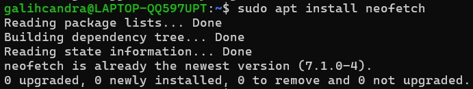
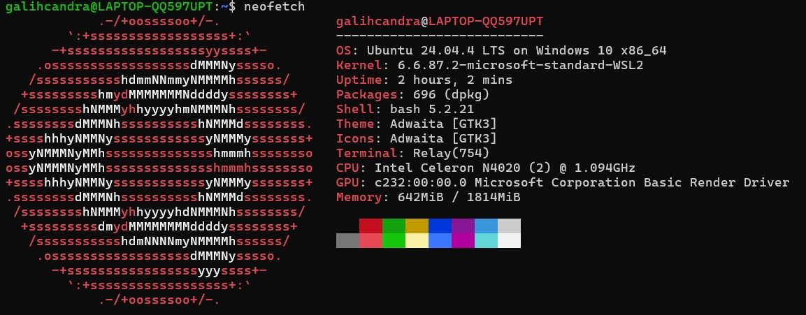
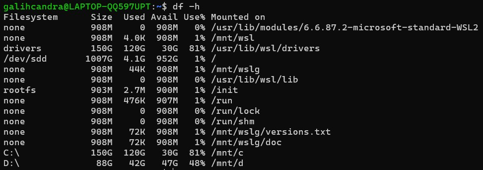

# LAPORAN JOBSHEET 1
Pengenalan Sistem Operasi & Instalasi

* Nama: Galih Candra Kirana
* NIM: 254107020078
* Kelas: TI-1G

## 1.10. Latihan
### 1.10.1. Latihan Konseptual

#### Latihan 1.1
Jelaskan 5 fungsi utama sistem operasi dengan contoh konkret dari minimal 2 OS berbeda (Windows, macOS, atau Linux).

Jawaban

1. Manajemen Proses
Sistem operasi berperan dalam mengendalikan berbagai aplikasi yang berjalan secara bersamaan agar tidak saling mengganggu. Contoh:
* Di Windows, pengguna bisa membuka Microsoft Word dan Google Chrome sekaligus, lalu memantau prosesnya melalui Task Manager.
* Di Linux, proses yang sedang berjalan dapat dilihat dan dikelola menggunakan perintah seperti top atau htop.

2. Manajemen Memori
Sistem operasi bertugas membagi dan mengontrol penggunaan RAM agar setiap aplikasi mendapat alokasi yang sesuai. Contoh:
* Pada Windows, terdapat fitur Virtual Memory yang membantu ketika RAM hampir penuh.
* Pada macOS, digunakan teknologi memory compression untuk mengoptimalkan penggunaan memori.

3. Manajemen File
Sistem operasi menyediakan sistem untuk menyimpan, memindahkan, serta menghapus file. Contoh:
* Di Windows, pengelolaan file dilakukan melalui File Explorer.
* Di Linux, file dapat diatur melalui file manager atau menggunakan perintah terminal seperti cp dan mv.

4. Manajemen Perangkat Keras
Sistem operasi menjadi penghubung antara perangkat keras dan perangkat lunak agar keduanya dapat bekerja dengan baik.
* Pada Windows, pengguna perlu menginstal driver agar printer dapat digunakan.
* Pada macOS, perangkat seperti mouse atau keyboard biasanya langsung terdeteksi secara otomatis.

5. Mengatur Keamanan dan Hak Akses
Sistem operasi memastikan keamanan sistem dengan membatasi hak akses pengguna. Contoh:
* Windows terdapat fitur User Account Control (UAC) yang membatasi akses administrator.
* Linux terdapat sistem permission seperti chmod dan penggunaan akun root untuk akses penuh.

#### Latihan 1.2
Kapan sebaiknya menggunakan Windows vs Linux vs macOS? Analisis berdasarkan use case: gaming, development, server, creative work, dan enterprise.

Jawaban

1. Gaming
Untuk kebutuhan gaming, Windows merupakan pilihan yang paling direkomendasikan karena memiliki dukungan game paling lengkap serta kompatibilitas tinggi dengan teknologi grafis seperti DirectX. Sebagian besar game populer dan AAA dikembangkan dengan optimalisasi utama untuk Windows. Linux dapat digunakan untuk gaming melalui platform seperti Steam dengan Proton, namun kompatibilitasnya belum sepenuhnya merata. Sementara itu, macOS memiliki dukungan game yang lebih terbatas sehingga kurang ideal untuk kebutuhan gaming.

2. Development
Dalam bidang pengembangan perangkat lunak, Linux sangat cocok digunakan terutama untuk backend development, DevOps, dan administrasi server karena lingkungannya mirip dengan server produksi. macOS juga menjadi pilihan yang kuat karena berbasis Unix serta wajib digunakan untuk pengembangan aplikasi iOS melalui Xcode. Windows lebih banyak digunakan dalam pengembangan aplikasi berbasis .NET dan sistem enterprise, serta kini didukung fitur WSL yang memungkinkan penggunaan lingkungan Linux di dalam Windows.

3. Server
Untuk kebutuhan server, Linux merupakan sistem operasi yang paling banyak digunakan karena stabil, ringan, serta memiliki tingkat keamanan yang baik. Sebagian besar server web dan layanan cloud berjalan di atas Linux. Windows Server biasanya digunakan dalam perusahaan yang mengandalkan ekosistem Microsoft, seperti Active Directory. macOS jarang digunakan sebagai sistem operasi server dalam skala produksi.

4. Creative Work
Dalam industri kreatif, macOS sering menjadi pilihan utama karena stabilitas sistem dan optimalisasi perangkat lunak seperti Final Cut Pro dan Logic Pro. Windows juga banyak digunakan karena kompatibel dengan berbagai software desain dan editing seperti Adobe Suite serta mendukung spesifikasi hardware yang dapat dikustomisasi. Linux memiliki alternatif perangkat lunak kreatif, namun belum menjadi standar utama di industri kreatif profesional.

5. Enterprise 
Dalam lingkungan perusahaan, Windows banyak digunakan sebagai sistem operasi klien karena integrasinya yang kuat dengan layanan Microsoft seperti Microsoft 365 dan Active Directory. Linux lebih sering digunakan pada sisi server karena efisien dan memiliki biaya lisensi yang lebih rendah. macOS biasanya digunakan di perusahaan berbasis teknologi atau industri kreatif, namun tidak seumum Windows dalam enterprise tradisional.

### 1.10.2. Latihan Praktikal

#### Latihan 1.3
Install Ubuntu Server 22.04 LTS di VirtualBox dengan langkah berikut:
1. Download Ubuntu Server ISO dari website resmi
2. Create VM baru di VirtualBox (RAM: 2GB, Disk: 25GB)
3. Install dengan automatic partitioning (guided)
4. Buat user account dengan password yang kuat
5. Reboot dan login ke sistem
6. Dokumentasikan proses instalasi dengan screenshot key steps

Jawaban
1. 
2. 
3. 

#### Latihan 1.4
Setelah instalasi Ubuntu Server, lakukan tasks berikut:
1. Update package list: sudo apt update

2. Upgrade packages: sudo apt upgrade

3. Install neofetch: sudo apt install neofetch

4. Jalankan neofetch dan screenshot hasilnya

5. Check disk usage dengan df -h

6. Check memory dengan free -h

7. Dokumentasikan output dari setiap command
