# LAPORAN JOBSHEET 10
Manajemen Memori & System Call

* Nama: Galih Candra Kirana
* NIM: 254107020080
* Kelas: TI-1G

## Praktikum 10.1 Melihat Penggunaan Memori
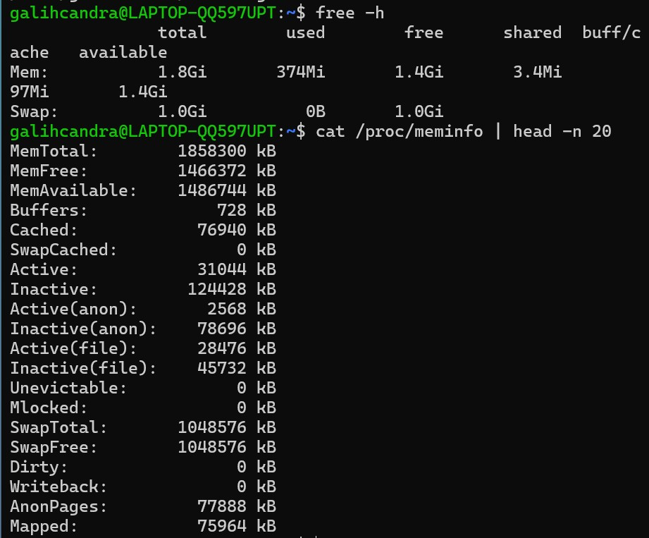

Hasil Analisis:
```bash
available / total × 100%
= 1.4 / 1.8 × 100%
≈ 77.7%

Berdasarkan percobaan yang telah dilakukan, sistem memiliki ketersediaan memori yang sangat cukup dengan persentase sekitar 78%. Tidak adanya penggunaan swap menunjukkan bahwa RAM masih mampu menangani seluruh proses yang berjalan. Secara keseluruhan, kondisi sistem berada dalam keadaan optimal dan tidak mengalami tekanan memori.
```

## Studi Kasus 10.1 Server Lambat karena Memori
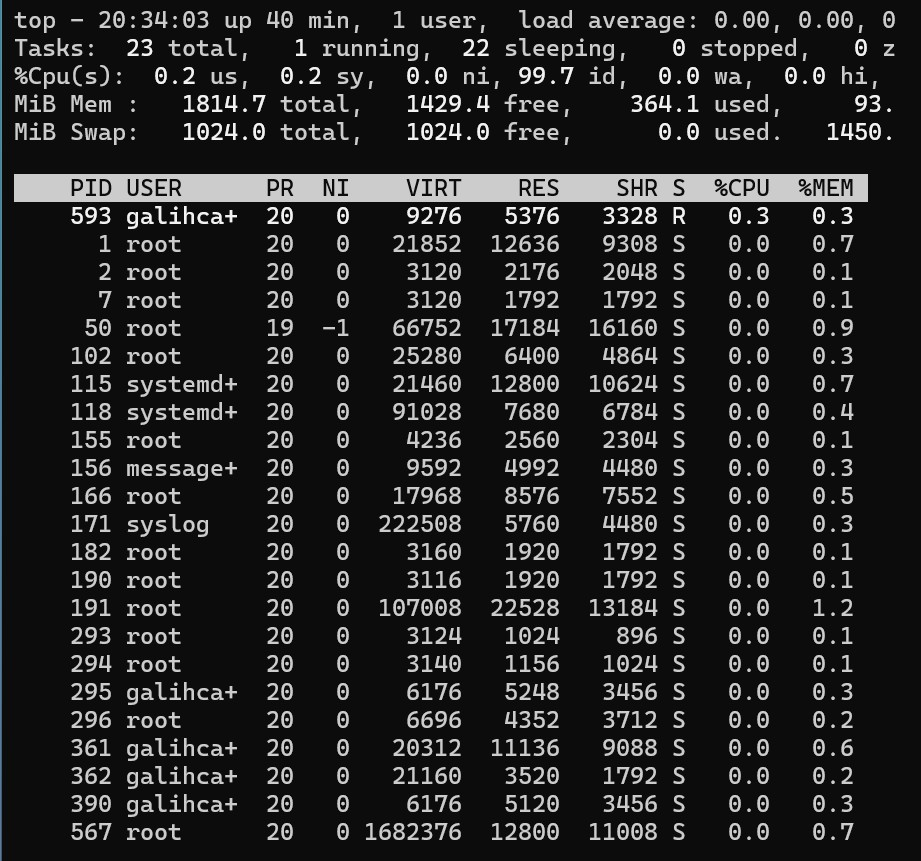
Hasil Analisis:
```bash
Dari hasil pengamatan, sistem tidak mengalami kekurangan memori karena masih memiliki sekitar 78% memori tersedia dan tidak menggunakan swap. Oleh karena itu, jika sistem terasa lambat, penyebabnya kemungkinan berasal dari faktor lain seperti CPU, disk, atau aplikasi yang berjalan.

1. Apakah nilai available kecil?
Tidak, nilai available masih besar (1.4 GB)
2. Apakah swap digunakan?
Tidak, swap masih 0 B
3. Proses dengan %MEM terbesar?
Ada, tetapi tidak signifikan karena memori masih longgar
```

## Praktikum 10.2 Mengamati Aktivitas Paging
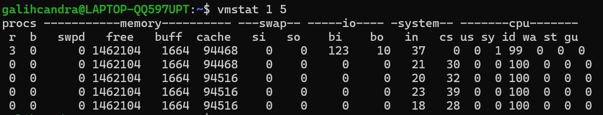

Hasil Analisis:
```bash
Dari hasil pengamatan menggunakan vmstat, sistem tidak menunjukkan adanya aktivitas paging karena nilai si dan so selalu 0. 
Hal ini menandakan bahwa RAM masih mencukupi dan tidak diperlukan penggunaan swap. Selain itu, CPU yang hampir 100% idle menunjukkan bahwa sistem tidak sedang menjalankan proses berat. 
Dengan demikian, sistem berada dalam kondisi optimal. 
Nilai si dan so selalu 0 karena saya memakai wsl. sehingga tidak adanya proses swap.
```

## Praktikum 10.3 Membuat dan Mengonfigurasi Swap File
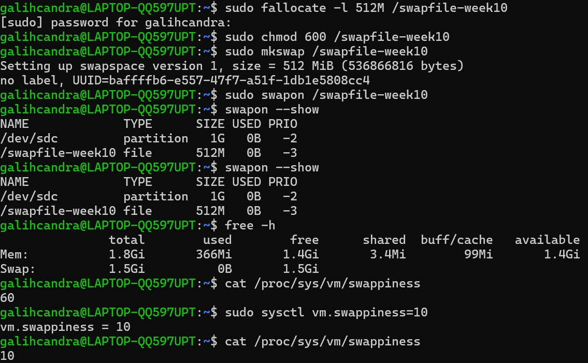

Hasil Analisis:
```bash
Penambahan swap file berhasil dilakukan dan sistem dapat mengenali swap baru dengan baik. 
Perubahan nilai swappiness dari default yaitu 60 menjadi 10 membuat sistem lebih mengutamakan penggunaan RAM dibanding swap, 
sehingga dapat meningkatkan performa.
```

## Praktikum 10.4 Monitoring Memory
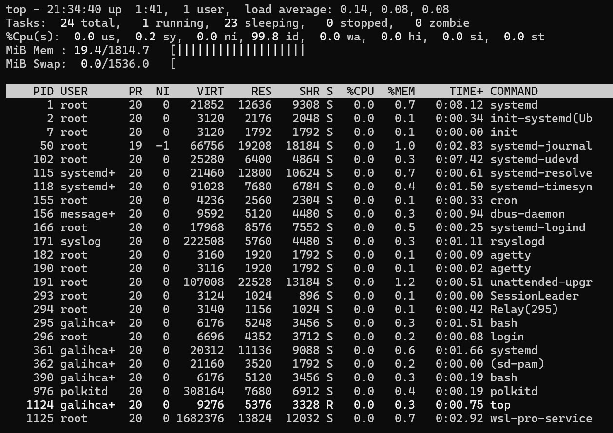

Hasil Analisis:
```bash
1. Proses apa yang berada di urutan pertama? Catat nilai %MEM dan RSS-nya.
Jawaban:
Proses yang berada di urutan pertama adalah proses dengan PID 1124 (user galihcandra).
%MEM = 0.3%
RSS (RES) = 5376 KB

2. Konversikan RSS dari KB ke MB (bagi 1024). Apakah wajar untuk jenis program tersebut?
Perhitungan:
5376 / 1024 ≈ 5.25 MB
Proses tersebut menggunakan sekitar 5.25 MB RAM.

3. Mengapa VSZ selalu lebih besar dari RSS pada proses yang sama?
Jawaban:
Karena VSZ (Virtual Memory Size) adalah total memori virtual yang dialokasikan oleh proses, sedangkan RSS (Resident Set Size) adalah memori fisik (RAM) yang benar-benar digunakan. Jadi, tidak semua memori virtual dimuat ke RAM, sehingga VSZ selalu lebih besar dari RSS.

4. Apakah urutan proses di ps konsisten dengan tampilan top saat diurutkan berdasarkan %MEM?
Jawaban:
Tidak selalu konsisten karena ps hanya menangkap(snapshot) sesaat, sedangkan top menampilkan data real time
```

## Praktikum 10.5 Script Monitor Memori
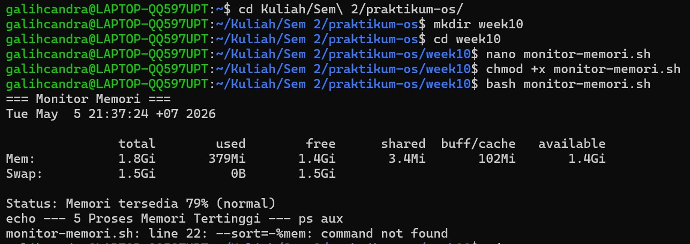

Hasil analisis:
```bash
Jika nilai THRESHOLD diubah menjadi 90, maka:

Output yang berubah:
Program akan lebih sering menampilkan peringatan
Bahkan pada kondisi normal sekalipun, sistem bisa dianggap “tidak aman”

Penyebab:
Persentase memori tersedia pada sistem umumnya tidak mencapai 90%, sehingga kondisi avail < 90 hampir selalu terpenuhi.
Setalah diubah, nilai threshold yang tinggi membuat sistem terlalu sensitif, sehingga sering memberikan peringatan meskipun kondisi sebenarnya masih normal.
```

## Studi Kasus 10.2 Gagal Akses 
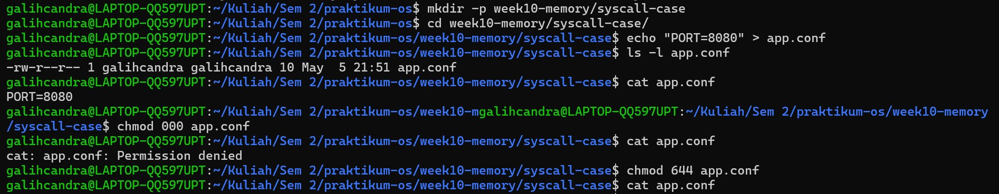

Hasil analisis:
```bash
1. Mengapa muncul "Permission denied" setelah chmod 000?
Jawaban:
Karena chmod 000 menghapus semua izin (read, write, execute), sehingga system call open() gagal membuka file

2. Perbedaan "Permission denied" vs "No such file or directory"
Error	                      Penyebab
Permission denied           : File ada, tapi tidak punya izin akses
No such file or directory	: File memang tidak ada
```

## Praktikum 10.6 Mengamati System Call dengan strace
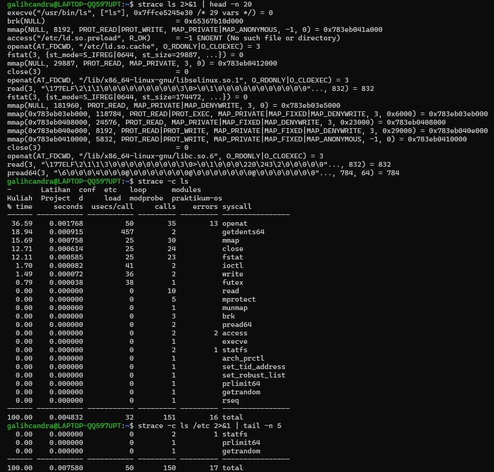

Hasil analisis:
```bash
1. Sebutkan minimal 4 system call dan fungsinya
Jawaban:
execve() : Menjalankan program (ls)
openat() : Membuka file/library
read()   : Membaca isi file
close()  : Menutup file
mmap()   : Memetakan file ke memori

2. System call yang paling sering dipanggil
Jawaban:
Berdasarkan hasil strace -c ls:
openat → 35 kali
mmap → 30 kali
close → 24 kali
fstat → 23 kali

openat sering dipanggil karena perintah dipaki untuk membuka banyak file & library serta membaca isi direktori.

3. Apakah ada system call dengan errors lebih dari 0? Apakah itu berarti program bermasalah, ataukah bagian normal dari logika program?
Jawaban:
Ada,seperti:
access("/etc/ld.so.preload", R_OK) = -1 ENOENT
Error tersebut adalah bagian normal dari logika program, bukan kegagalan fatal.

4. Apakah jumlah system call berbeda antara ls dan ls /etc? Faktor apa yang menyebabkan perbedaan tersebut?
Jawaban:
Tidak terlalu berbeda secara signifikan.

Faktor yang menyebabkan perbedaan tersebut
1. file dalam direktori
/etc biasanya berisi lebih banyak file, sehingga proses membaca direktori lebih kompleks
2. Operasi pembacaan direktori (getdents64)
semakin banyak file → semakin banyak data yang dibaca
3. Metadata file (stat, fstat)
setiap file bisa memicu pengecekan tambahan
4. Cache sistem
jika direktori sudah pernah diakses, maka bisa lebih cepat
jika belum, maka butuh akses disk lebih banyak
```

## Tugas Praktikum

### Tugas 10.1 Audit Penggunaan Memori Sistem
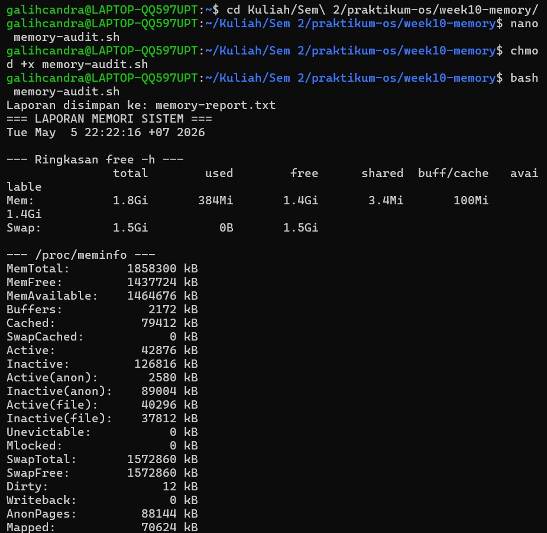

Hasil analisis:
```bash
1. Hitung persentase memori tersedia (available / total × 100%). Apakah sistem dalam kondisi normal?
Jawaban:
MemTotal = 1,858,300 kB
MemAvailable = 1,464,676 kB

Perhitungan:
1,858,300 / 1,464,676 × 100% = 78.8%
 78.8%

Sistem dalam kondisi normal karena persentase memori sangat tinggi.

2. Mengapa buff/cache tidak dihitung sebagai memori yang terpakai dari sudut pandang ketersediaan untuk aplikasi?
Jawaban:
buff/cache tidak dihitung sebagai memori terpakai karena:
    Digunakan oleh kernel untuk mempercepat akses file (cache & buffer)
    Bersifat sementara dan fleksibel
    Bisa dibebaskan otomatis saat aplikasi membutuhkan memori

3. Dari /proc/meminfo, apakah SwapTotal lebih besar dari 0? Berapa nilai SwapFree?
Jawaban:
Ya, SwapTotal > 0 (artinya swap tersedia)
SwapFree = SwapTotal, artinya swap belum digunakan sama sekali
SwapTotal = 1,572,860 kB (~1.5 GB)
SwapFree = 1,572,860 kB (~1.5 GB)
```

### Tugas 10.2 Identifikasi Proses dengan Memori Tertinggi
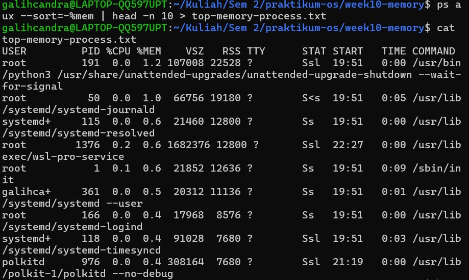

Hasil analisis:
```bash
1. Proses apa di urutan pertama? Catat nilai %MEM dan RSS.
Jawaban:
Proses di urutan pertama adalah:
/usr/bin/python3 (unattended-upgrade-shutdown)
%MEM = 1.2%
RSS = 22528 KB

2. Konversikan RSS ke MB (bagi 1024). Apakah wajar?
Jawaban:
22528÷1024=22 MB
RSS ≈ 22 MB
Penggunaan 22 MB untuk proses background Python sangat wajar, bahkan tergolong ringan.

3. Jumlahkan %MEM dari 5 proses teratas. Berapa persen RAM yang mereka gunakan bersama?
Jawaban:
1.2+1.0+0.6+0.6+0.6= 4.0%
```

### Tugas 10.3 Membuat dan Memverifikasi Swap File
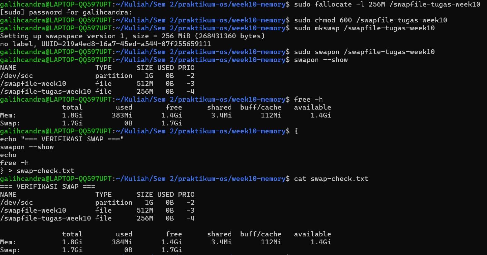

Hasil analisis:
```bash
1. Identifikasi kolom NAME, TYPE, SIZE, dan USED pada output swapon --show.
Jawaban:
NAME : lokasi swap
    /swapfile-tugas-week10, /dev/sdc
TYPE : 
    partition → swap dari partisi disk
    file → swap dari file
SIZE : ukuran swap
    /swapfile-tugas-week10 = 256M
USED : penggunaan swap saat ini
    Semua bernilai 0B(belum digunakan)

2. Apakah nilai total pada baris Swap di free -h bertambah 256 MB?
Jawaban:
Ya, total swap bertambah sekitar 256 MB.
Swap: 1.7Gi total
Sebelumnya (dari Tugas 10.1): Swap ≈ 1.5 Gi

3. Mengapa permission 600 penting? Apa risiko jika diatur ke 644?
Jawaban:
Permission 600 berarti:
Hanya root yang dapat membaca dan menulis file swap
Alasan:
Swap menyimpan data dari RAM
Bisa berisi password, data aplikasi, dan informasi sensitif lainnya

Risiko jika 644:
User lain bisa membaca isi swap, sehingga dapat menyebabkan kebocoran data dan pelanggaran keamanan sistem
```

### Tugas 10.4 Analisis System Call dengan strace
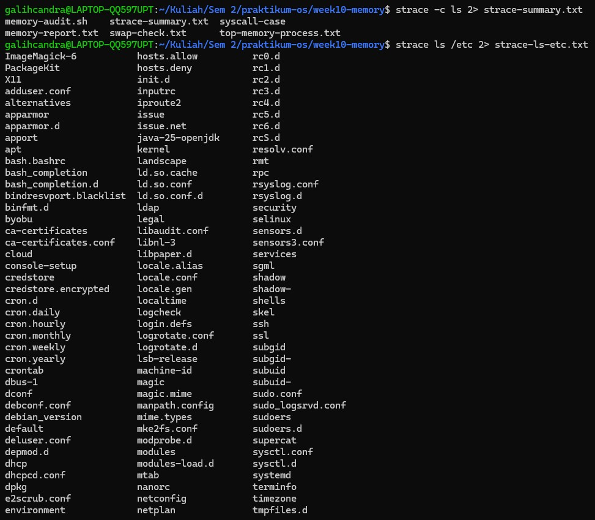
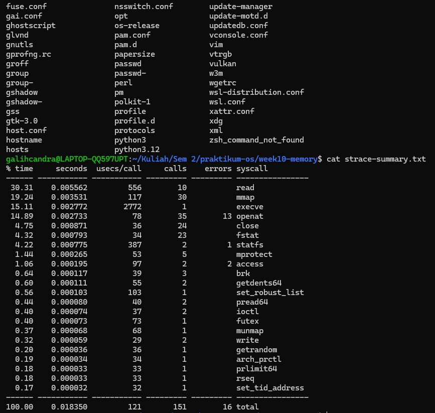

Hasil analisis:
```bash
1. Sebutkan minimal 5 system call dari strace-summary.txt beserta fungsi singkatnya.
Jawaban:
read(): Membaca data dari file atau input (misalnya membaca isi direktori)
openat(): Membuka file atau direktori dengan path tertentu
close(): Menutup file descriptor setelah selesai digunakan
fstat(): Mengambil informasi metadata file (ukuran, permission, dll)
getdents64(): Membaca isi direktori (digunakan oleh ls untuk menampilkan daftar file)

2. System call mana yang paling sering dipanggil? Mengapa?
Jawaban:
read: 30 calls
mmap: 30 calls
openat: 35 calls

Yang paling sering:
openat() (35 kali)
Alasan:
Karena perintah ls bisa melakukan banyak hal, seperti:
    Membuka banyak file/direktori
    Mengecek isi dan atribut setiap file
    Setiap akses membutuhkan pemanggilan openat()

3. Apakah ada errors lebih dari 0? Apakah program tetap berjalan normal meskipun ada kegagalan tersebut?
Jawaban:
Ya, terdapat error (total 16 error)
openat → 13 errors
access → 2 errors
statfs → 1 error
Total error = 16

Penjelasannya:
Error seperti ini biasanya, file tidak ditemukan (ENOENT), tidak punya akses, ini normal dalam proses kerja program.
```

### Tugas 10.5 Studi Kasus Diagnosa Server Lambat


Hasil analisis:
```bash
1. Jelaskan peran masing-masing fungsi: cek_memori, cek_swap, cek_proses, cek_paging, dan ringkasan. Mengapa diagnosa dipecah menjadi fungsi terpisah?
Jawaban:
cek_memori
Menampilkan kondisi RAM dan menghitung persentase memori tersedia untuk menentukan apakah memori dalam kondisi normal atau kritis.
cek_swap
Menampilkan status swap dan mendeteksi apakah swap sedang digunakan sebagai indikator kekurangan RAM.
cek_proses
Menampilkan 10 proses dengan penggunaan memori terbesar untuk mengetahui proses yang paling membebani sistem.
cek_paging
Menggunakan vmstat untuk memantau aktivitas paging (si dan so) yang menunjukkan perpindahan data antara RAM dan swap.
ringkasan
Memberikan kesimpulan akhir kondisi sistem berdasarkan hasil dari semua pengecekan sebelumnya.

Alasan dipisah menjadi fungsi:
Agar program modular dan terstruktur
Memudahkan pembacaan dan pemahaman
Mempermudah perbaikan (maintenance)
Setiap fungsi memiliki tugas spesifik (single responsibility)

2. Berdasarkan bagian RINGKASAN, apakah kondisi sistem normal atau kritis? Jelaskan berdasarkan nilai threshold yang digunakan script.
Jawaban:
Kondisi sistem adalah NORMAL.

Memori available ≈ 1.4 Gi dari total 1.8 Gi
Swap = 0
Perkiraan persentase = 77%
Threshold script = 20%
Memori tersedia ≈ 77% (>20%)
Jadi, wap tidak digunakan

3. Mengapa script menggunakan tee "$LAPORAN" bukan redirection biasa > "$LAPORAN"? Apa keuntungannya?
Jawaban:
tee digunakan untuk:
Menampilkan output ke terminal
Sekaligus menyimpan ke file

Keuntungan:
Bisa melihat hasil secara langsung
Tetap mendapatkan file laporan
Lebih efisien untuk monitoring dan dokumentasi

4. Dari output cek_paging, apakah ada aktivitas si atau so? Jika ada, apa implikasinya terhadap performa server?
Jawaban:
si = 0
so = 0

Sehingga:
Tidak ada aktivitas swap in (si)
Tidak ada aktivitas swap out (so)

Jadi, tidak terjadi paging, RAM masih sangat cukup, tidak ada penurunan performa akibat akses disk.
```