# LAPORAN TUGAS PROYEK
## Membuat Custom Ubuntu ISO dengan Cubic

* Nama  : Galih Candra Kirana
* NIM   : 254107020080
* Kelas : TI-1G

## 1. Persiapan dan Download ISO Ubuntu 24.04 LTS

**Hasil:** Berhasil mengunduh file ISO Ubuntu 24.04 LTS dari sumber resmi https://releases.ubuntu.com/24.04/

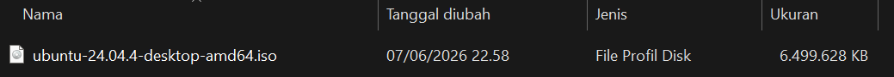

## 2. Verifikasi Checksum ISO Sumber

**Hasil:** Berhasil memverifikasi SHA256 ISO Ubuntu 24.04 LTS, checksum cocok dengan nilai resmi di releases.ubuntu.com/24.04/SHA256SUMS

```bash
galihcandra@LAPTOP-QQ597UPT:~/Kuliah/Sem 2/praktikum-os/week14$ sha256sum ubuntu-24.04.4-desktop-amd64.iso
3a4c9877b483ab46d7c3fbe165a0db275e1ae3cfe56a5657e5a47c2f99a99d1e  ubuntu-24.04.4-desktop-amd64.iso
```
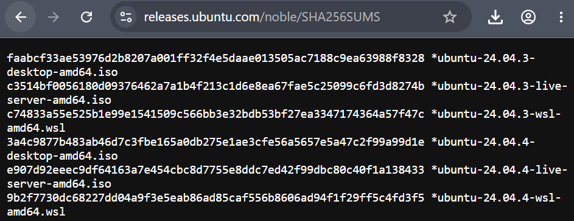

---

## 3. Instalasi Cubic dari PPA Resmi

**Hasil:** Berhasil menginstall Cubic dari github 

```bash
sudo apt-add-repository universe
sudo apt-add-repository ppa:cubic-wizard/release
sudo apt update
sudo apt install --no-install-recommends cubic
```

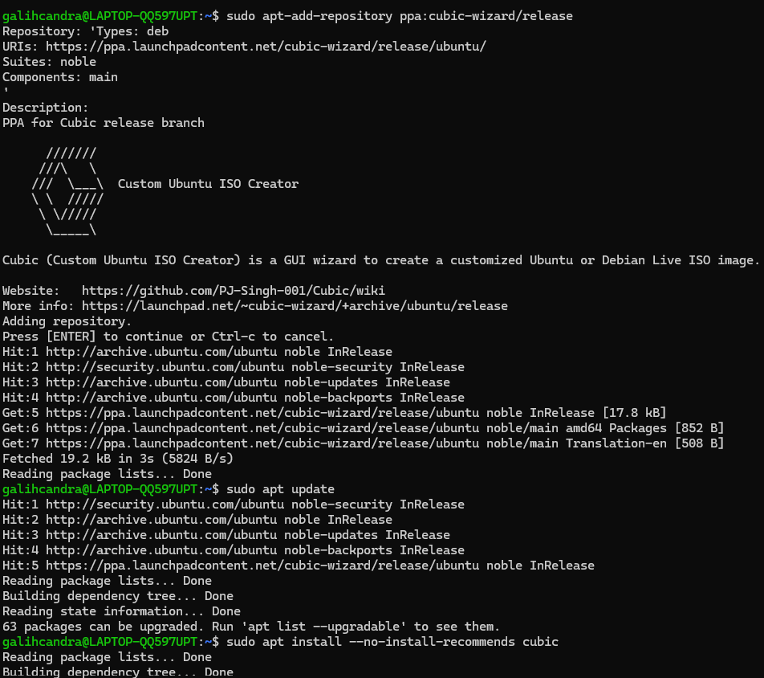


## 4. Persiapan Proyek Remastering Baru

**Hasil:** Berhasil membuat project directory dan mengimport ISO Ubuntu 24.04 ke Cubic

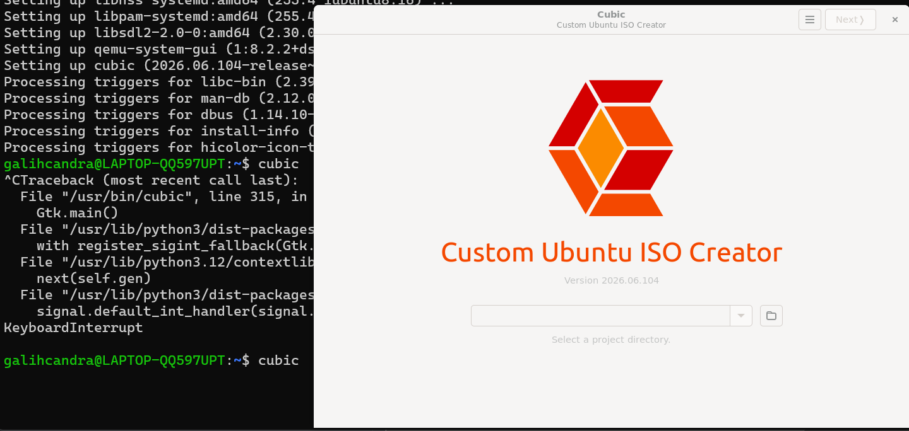
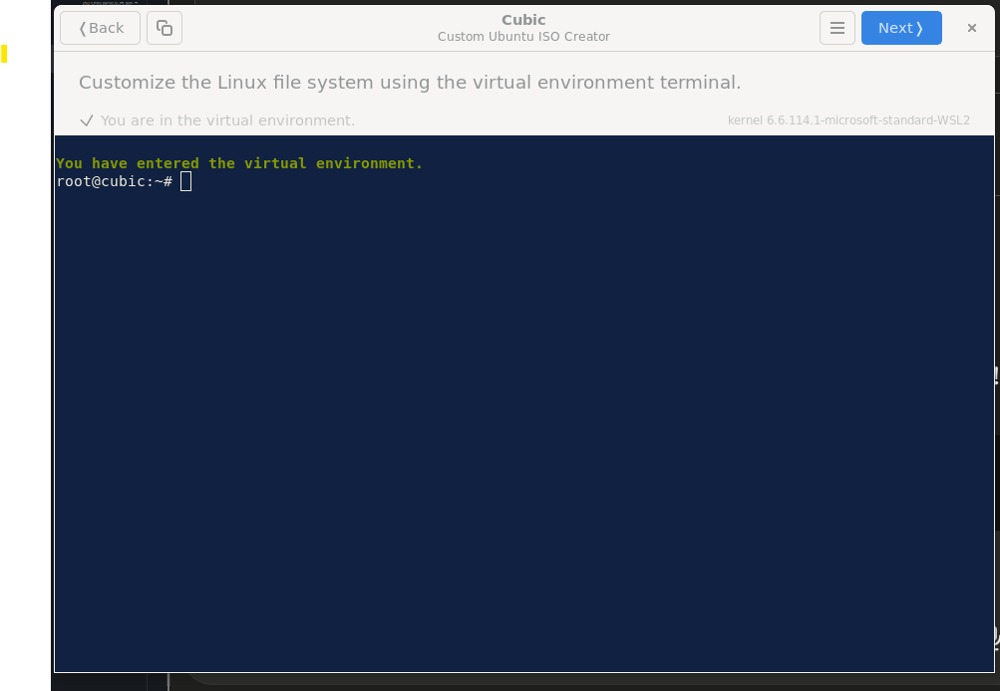


## 5. Kustomisasi dan Instalasi Aplikasi

**Hasil:** Berhasil menginstall VLC, GIMP, Apache2, PHP, VS Code

```bash
apt update
apt install vlc gimp apache2 php -y
sudo snap install code --classic
```

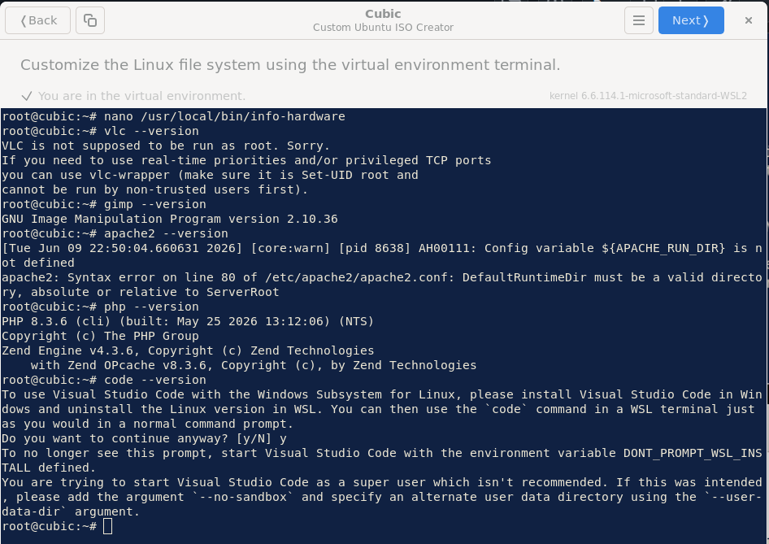


## 6. Membuat Bash Script Cek Hardware

**Hasil:** Berhasil membuat script bash `cek-hardware` yang menampilkan informasi hardware sistem

```bash
cat > /usr/local/bin/cek-hardware << 'EOF'
#!/bin/bash
echo "===== Informasi Hardware ====="
echo "Hostname   : $(hostname)"
echo "CPU        : $(lscpu | grep 'Model name' | cut -d: -f2 | xargs)"
echo "RAM Total  : $(free -h)"
echo "Disk       : $(df -h)"
echo "=============================="
EOF
chmod +x /usr/local/bin/cek-hardware
```

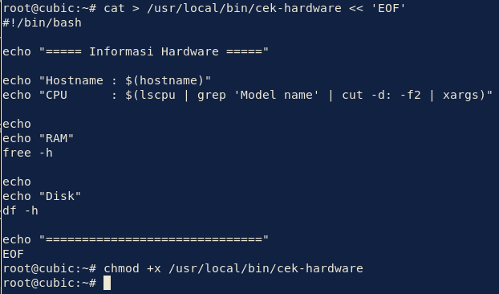
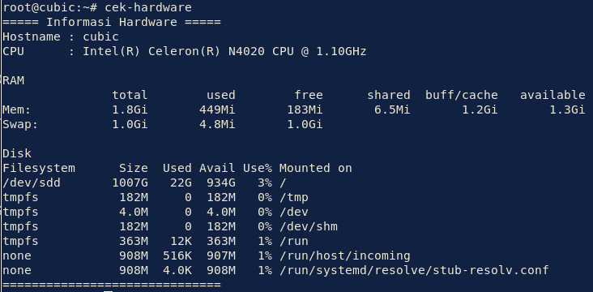


## 7. Kustomisasi Tampilan Desktop

**Hasil:** Berhasil mengubah wallpaper, tema, dan ikon desktop

```bash
apt install arc-theme papirus-icon-theme -y
```

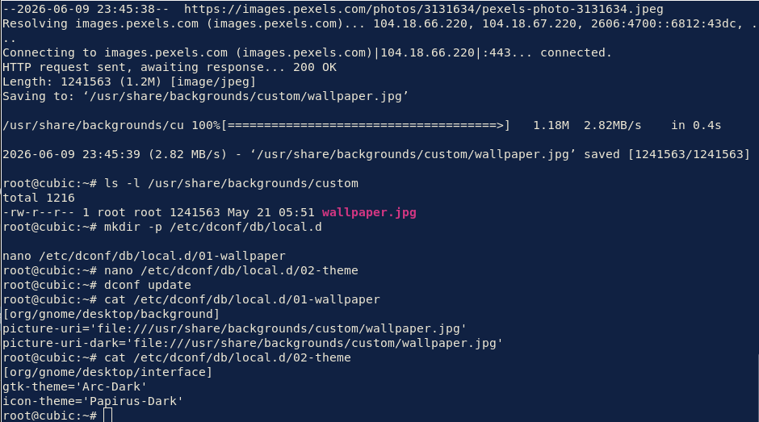


## 8. Pembuatan ISO Baru

**Hasil:** Proses build berhasil dengan nama file `Ubuntu-Custom-254107020080.iso`

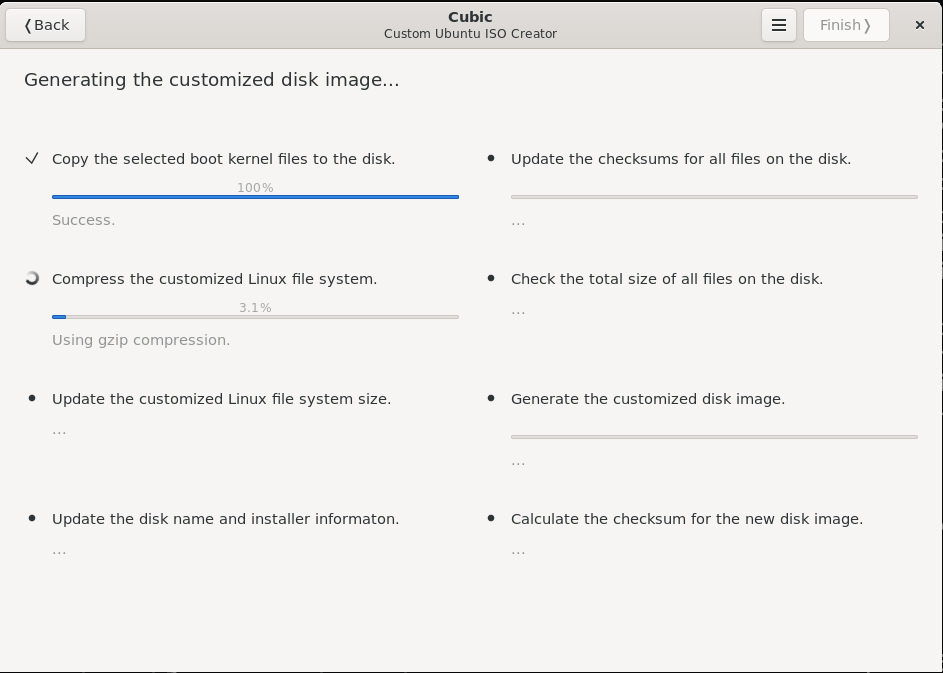


## 9. Verifikasi Checksum ISO Hasil

**Hasil:** Berhasil menghitung SHA256 ISO hasil remaster 

```bash
PS C:\Users\USER> Get-FileHash "D:\Ubuntu-Custom-254107020080.iso" -Algorithm SHA256

Algorithm       Hash                                                                   Path
---------       ----                                                                   ----
SHA256          54F137FC07F926AE75F4368D075262C1C708779C856530808EC7BDE7005D8F0C       D:\Ubuntu-Custom-254107020080...

```


## 10. Pengujian ISO di Virtual Machine

**Hasil:** ISO berhasil di-boot di VirtualBox, desktop muncul normal, semua aplikasi tersedia di Desktop

```bash
cek-hardware
php --version
apache2 -v
vlc --version
gimp --version
code --version
```

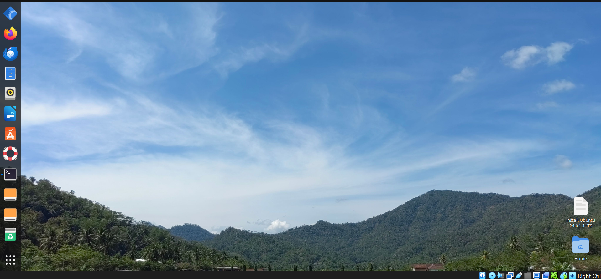
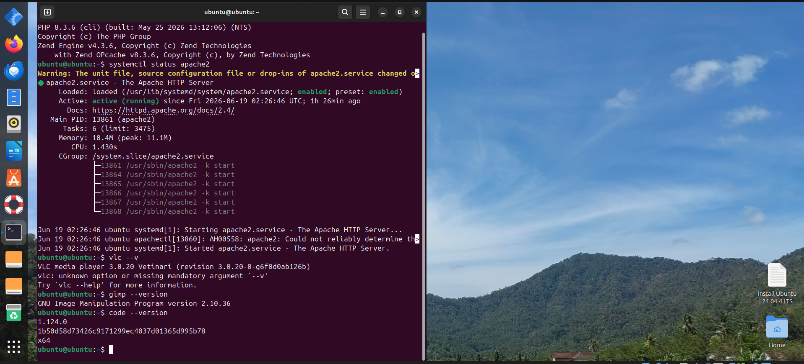
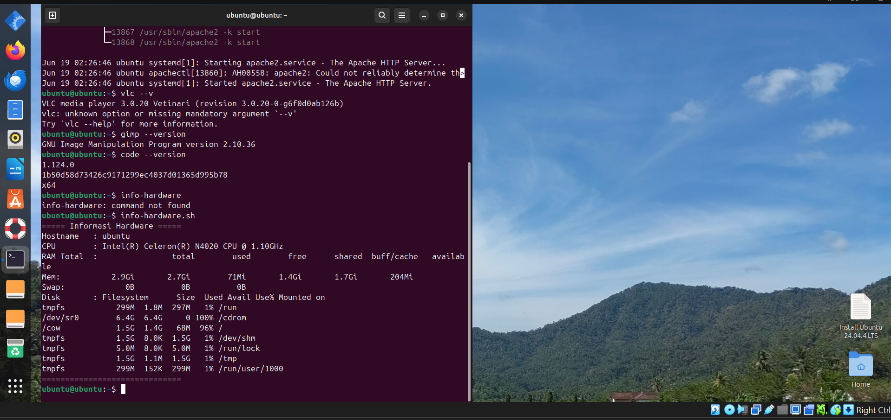