# Laporan Jobsheet 2
Manajemen Perangkat Keras & Perintah Dasar Sistem Operasi

* Nama: Galih Candra Kirana
* NIM: 254107020078
* Kelas: TI-1G

## Praktikum 2.1: Identifikasi CPU dan Memori
Tujuan: memahami spesifikasi CPU dan kondisi memori pada server/VM.

### Langkah-langkah
1. Tampilkan informasi CPU:
```bash
lscpu
```
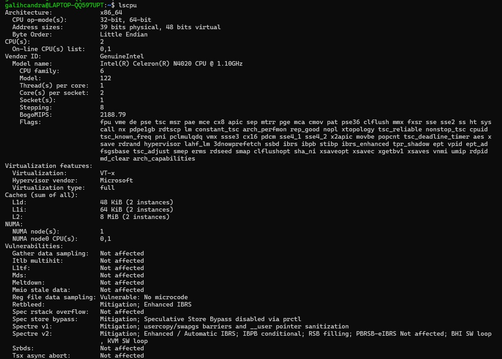

2. Tampilkan ringkasan memori:
```bash
free -h
```
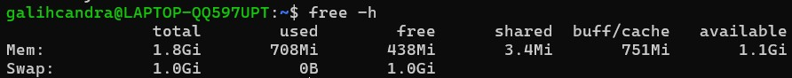 

3. (Opsional) cek informasi hardware dari DMI/BIOS (butuh sudo): 
```bash
sudo dmidecode -t system
```
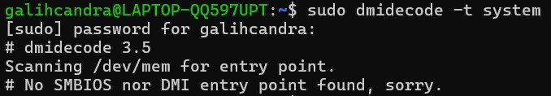 

### Latihan 2.1
Catat: (1) jumlah CPU(s), core/thread, (2) total RAM, (3) total swap. Jelaskan perbedaan RAM vs swap dalam 2–3 kalimat.

Jawaban

* Berdasarkan hasil perintah lscpu, sistem memiliki 2 CPU(s), dengan 2 core dan 1 thread per core (total 2 logical CPU).
* Total RAM: 1.8 GiB
* Total Swap: 1.0 GiB
* Perbedaan RAM vs swap: Ram adalah penyimpanan data utama yang sangat cepat untuk menjalankan program secara langsung. Sedangkan swap berfungsi sebagai memori virtual di dalam hard drive yang baru akan aktif ketika RAM tidak lagi mampu menampung beban aplikasi yang berjalan.

## Praktikum 2.2: Identifikasi Perangkat PCI/USB dan Driver
Tujuan: mengenali perangkat PCI/USB dan melihat driver/modul yang dipakai.

### Langkah-langkah
1. Lihat daftar perangkat PCI:
```bash
lspci
```
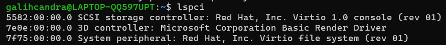

2. Lihat perangkat PCI beserta driver kernel yang digunakan:
```bash
lspci -nnk
```
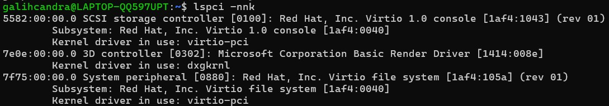 

3. Fokus pada NIC (Ethernet) untuk mencari modul driver:
```bash
lspci - nnk | grep - A3 -i ethernet
```
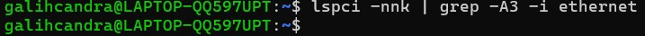 

4. Lihat perangkat USB:
```bash
lsusb
```
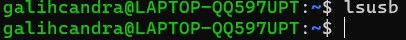 

5. Lihat topologi USB (tree):
```bash
lsusb -t
```
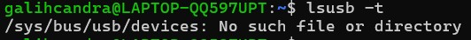 

### Latihan 2.2
Temukan 1 perangkat PCI (misal NIC) dan tuliskan: Vendor:Device ID (angka
heksadesimal), nama driver/modul kernel, dan deskripsi singkat fungsinya.

Jawaban

* Vendor:Device ID | 1af4:1043
* Perangkat | SCSI storage controller
* Driver/Modul Kernel	| virtio-pci
* Deskripsi Fungsi | Berfungsi sebagai pengontrol penyimpanan data virtual yang memungkinkan sistem operasi berkomunikasi dengan media penyimpanan (disk) menggunakan protokol Virtio untuk performa tinggi di lingkungan virtualisasi.

## Praktikum 2.3: Identifikasi Storage dan Filesystem
Tujuan: memahami disk/partisi dan filesystem yang terpasang

### Langkah-langkah
1. Lihat daftar disk/partisi:
```bash
lsblk -f
```
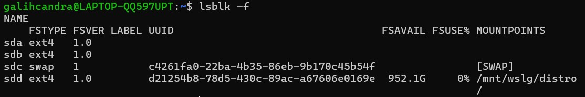

2. Tampilkan UUID dan tipe filesystem:
```bash
sudo blkid
```
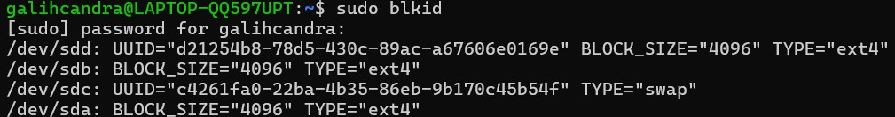 

3. Lihat mount point untuk root filesystem:
```bash
findmnt /
```
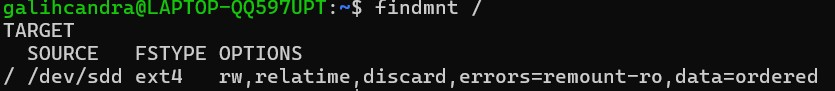 

## Praktikum 2.4: Melihat Modul Aktif dan Informasinya
Tujuan: mengenal modul aktif dan keterkaitannya dengan perangkat.

### Langkah-langkah
1. Cek versi kernel:
```bash
uname -r
```
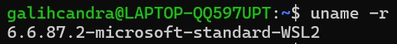

2. Tampilkan daftar modul aktif:
```bash
lsmod | head
```
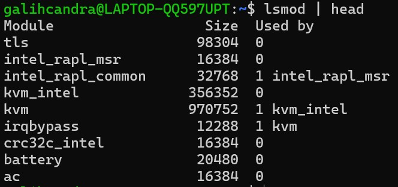 

3. Pilih salah satu modul (contoh aman: loop) dan lihat detailnya:
```bash
modinfo loop
```
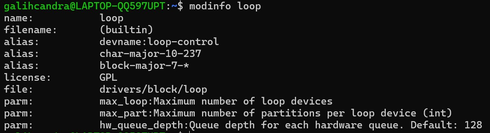 

4. Muat modul (jika belum aktif), lalu verifikasi:
```bash
sudo modprobe loop
lsmod | grep -i loop
```
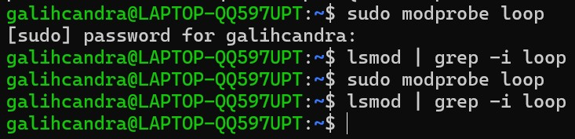 

5. (Opsional) lihat pesan kernel terbaru:
```bash
dmesg -T | tail -n 20
```
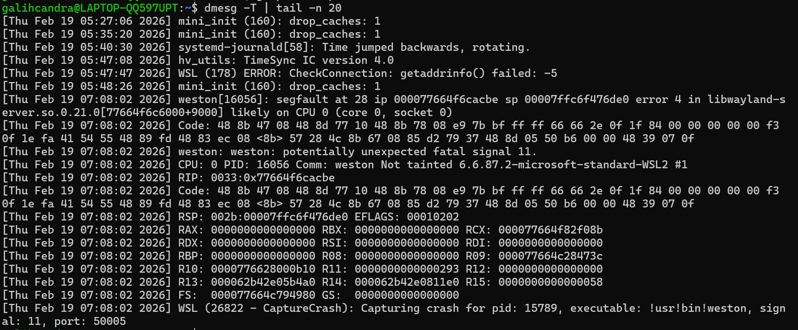 

## Praktikum 2.5: Konfigurasi Auto-load dan Blacklist
Tujuan: memahami cara membuat modul otomatis dimuat atau diblokir.

### Langkah-langkah
1. Buat file auto-load:
```bash
echo "loop" | sudo tee /etc/modules-load.d/loop.conf
```
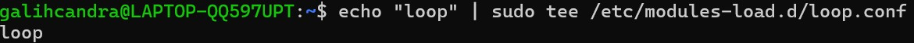

2. Simulasikan verifikasi (tanpa reboot) dengan memastikan modul sudah aktif:
```bash
lsmod | grep -i loop
```
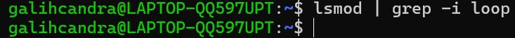 

3. (Opsional, konsep) blacklist modul:
```bash
# echo "blacklist loop" | sudo tee /etc/modprobe .d/blacklist-loop.conf
```
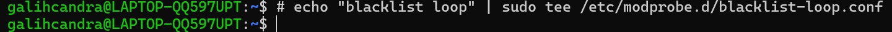 

## Praktikum 2.6: Mengenali Block vs Character Device
Tujuan: membedakan perangkat disk vs terminal

### Langkah-langkah
1. Lihat detail salah satu disk (sesuaikan dengan perangkat Anda, misal sda)
```bash
ls -l /dev/sda
```
Berdasarkan hasil lsblk, disk utama sistem saya adalah /dev/sdd karena ter-mount pada direktori root (/).
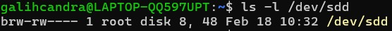

2. Lihat detail device terminal:
```bash
ls -l /dev/tty
```
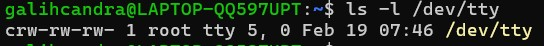 

3. Lihat disk dan partisi untuk mengaitkan dengan /dev:
```bash
lsblk
```
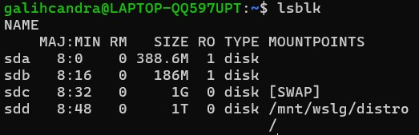 

### Latihan 2.3
Dari output ls -l, jelaskan perbedaan penanda file untuk block device dan
character device. (Hint: karakter pertama pada permission string)

Jawaban

Perbedaan penanda file block device dan character device bisa dilihat dari karakter pertama pada output ls -1. Block device dapat ditandai dengan huruf b, sedangkan character device ditandai dengan huruf c. 

## Praktikum 2.7: Melihat Informasi udev
Tujuan: melihat metadata yang dipakai udev untuk membuat device node

### Langkah-langkah
1. Cek atribut udev untuk disk:
```bash
udevadm info --query=all --name=/dev/sda | head -n 30
```
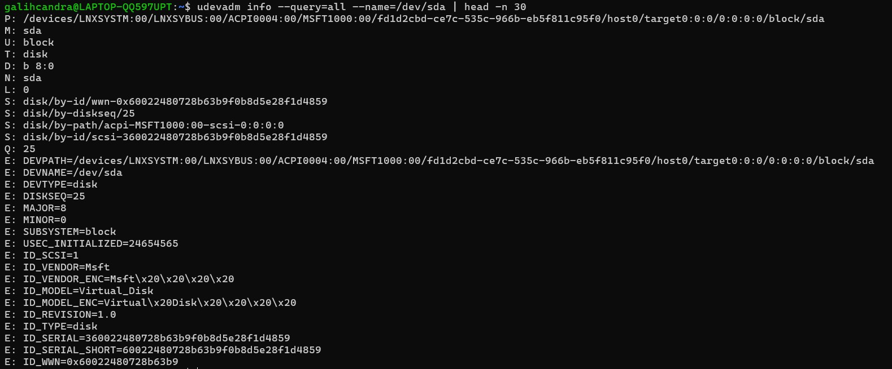

2. (Opsional) monitor event udev (jalankan, lalu colok/lepas USB pada mesin fisik):
```bash
sudo udevadm monitor
```
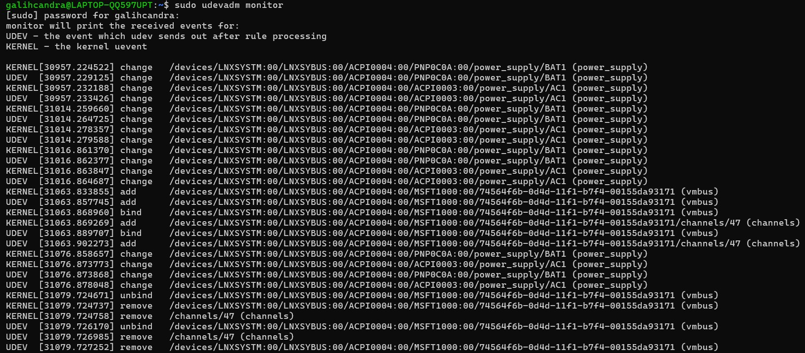 

## Praktikum 2.8: Membuat Workspace Praktikum
Tujuan: membuat area kerja aman untuk semua latihan bab ini.

### Langkah-langkah
1. Buat direktori praktikum dan masuk ke dalamnya:
```bash
1 mkdir -p ~/praktikum-os/week02
2 cd ~/praktikum-os/week02
3 pwd
```
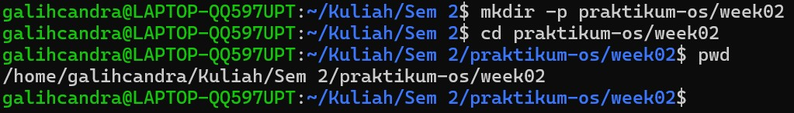

2. Buat beberapa file contoh:
```bash
1 touch notes.txt data.log config.txt
2 ls -lah
```
 

3. Isi file log contoh (simulasi):
```bash
1 echo "INFO : service started" >> data.log
2 echo "WARN : disk usage high" >> data.log
3 echo "ERROR : failed to connect" >> data.log
4 cat data.log
```
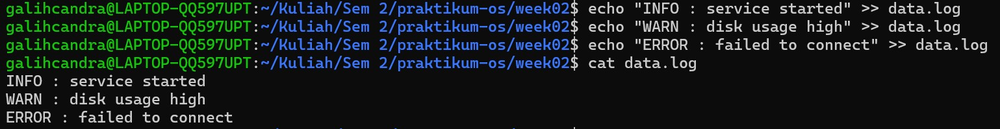 

4. Baca file dengan less:
```bash
less data.log
```
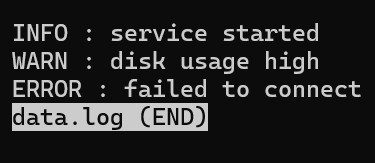 

## Praktikum 2.9: Pencarian Pola dengan grep

1. Cari baris yang mengandung ERROR pada data.log:
```bash
grep "ERROR" data.log
```
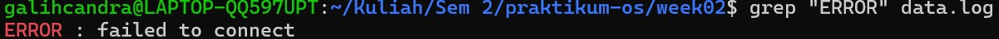

2. Cari tanpa memperhatikan huruf besar/kecil:
```bash
grep -i "error" data.log
```
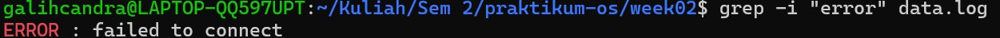 

3. Tampilkan nomor baris:
```bash
grep -n "WARN" data.log
```
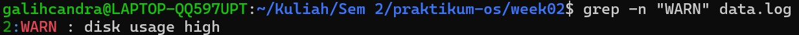 

4. Tampilkan baris yang tidak cocok (invert match):
```bash
grep -v "INFO" data.log
```
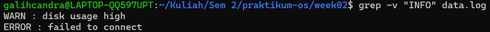 

### Latihan 2.4
Gunakan grep untuk menampilkan hanya baris yang mengandung INFO atau
WARN dari data.log. (Hint: gunakan grep -E dengan pola alternatif)

Jawaban

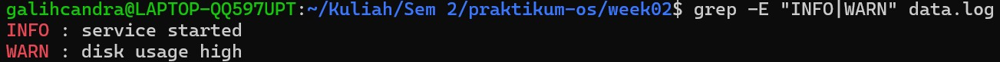 

## Praktikum 2.10: Substitusi dengan sed (Aman di File Latihan)

1. Siapkan file konfigurasi latihan:
```bash
1 cat > config.txt << 'EOF'
2 PORT=8080
3 MODE=dev
4 SERVICE_NAME=myserver
5 EOF
6 cat config.txt
```
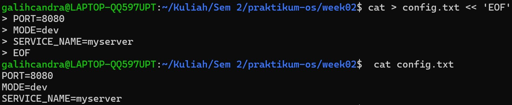

2. Ganti dev menjadi prod (tanpa mengubah file asli):
```bash
sed 's/MODE=dev/MODE=prod/' config.txt
```
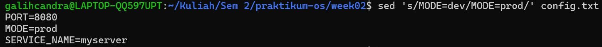 

3. Terapkan perubahan langsung ke file (-i):
```bash
1 sed -i 's/MODE=dev/MODE=prod/' config.txt
2 cat config.txt
```
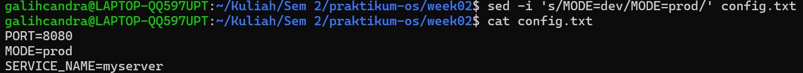 

4. Ganti semua kemunculan kata (g untuk global), contoh ubah myserver menjadi node:
```bash
1 sed -i 's/myserver/node/g' config.txt
2 cat config.txt
```
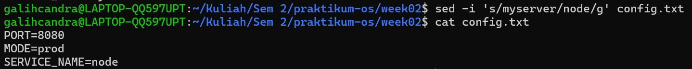 

## Praktikum 2.11: Ekstraksi Kolom dengan awk

1. Lihat output df -h:
```bash
df -h
```
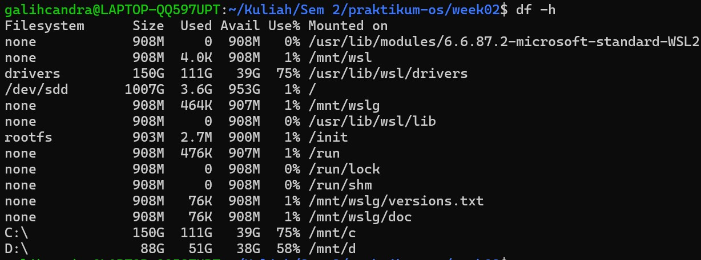

2. Ambil kolom filesystem dan persentase pemakaian:
```bash
df -h | awk 'NR==1 {print $1 , $5 , $6} NR>1 {print $1, $5, $6}'
```
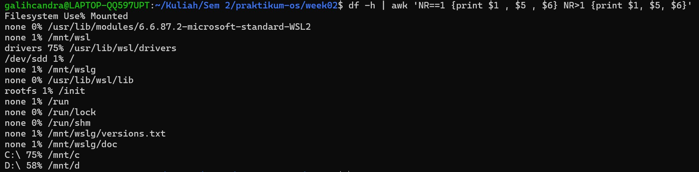 

3. Filter hanya yang pemakaian disk di atas 80%:
```bash
df -h | awk 'NR==1 || ($5+0) > 80 {print $1 , $5 , $6}'
```
 

## Praktikum 2.12: Melihat Proses dengan ps

1. Tampilkan semua proses (format BSD):
```bash
ps aux | head
```
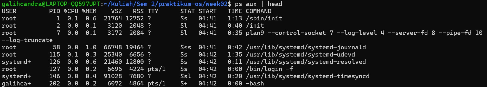

2. Cari proses tertentu (misal sshd):
```bash
ps aux | grep -i sshd
```
 

## Praktikum 2.13: Monitoring Real-time dengan top

1. Jalankan top:
```bash
top
```
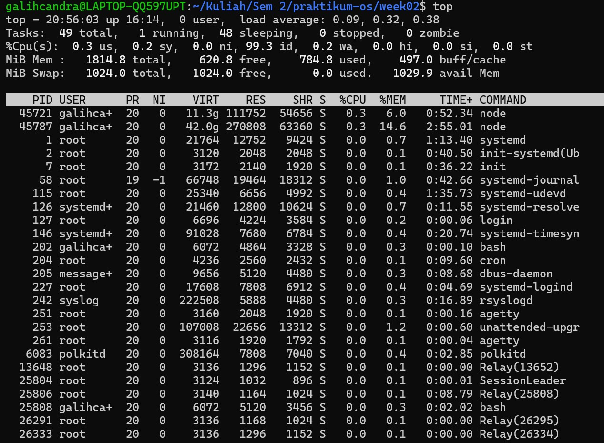

2. Amati nilai load average, pemakaian CPU, dan proses teratas. Tekan q untukkeluar
```bash
ps aux | grep -i sshd
```
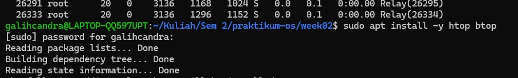 

## Praktikum 2.14: Menghentikan Proses dengan kill

1. Jalankan proses dummy di background:
```bash
sleep 300 &
```
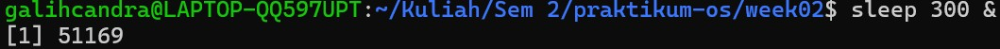

2. Cari PID proses sleep:
```bash
ps aux | grep -E "sleep 300" | grep -v grep
```
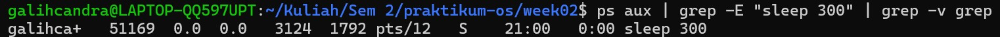 

3. Hentikan dengan SIGTERM:
```bash
kill < PID_ANDA >
```
 

4. Verifikasi proses berhenti:
```bash
ps aux | grep -E "sleep 300" | grep -v grep
```
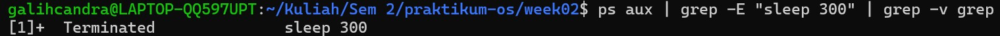 
