# LAPORAN JOBSHEET 6
Manajemen Proses

* Nama: Galih Candra Kirana
* NIM: 254107020080
* Kelas: TI-1G

## Praktikum 6.1 — Melihat Proses dan Thread
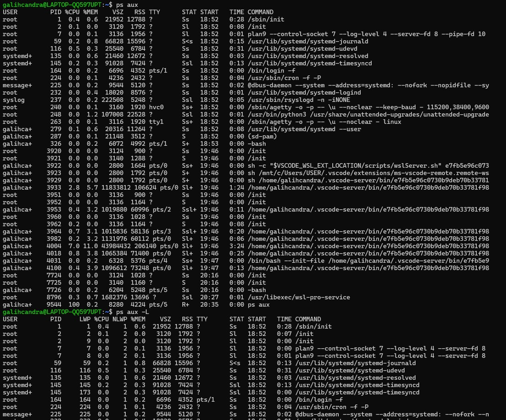
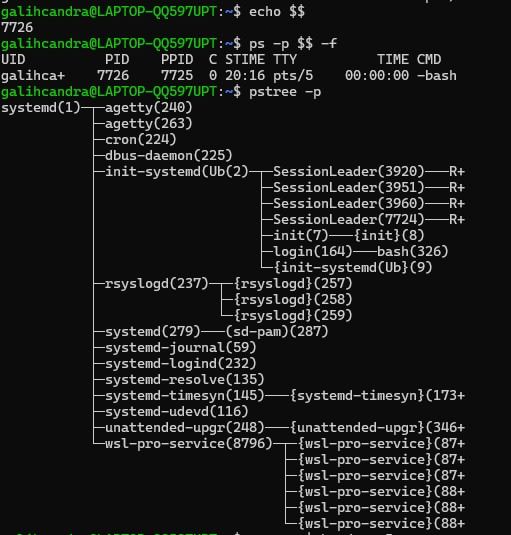
### Latihan 6.1
Jalankan ps aux dan amati outputnya:
1. Berapa total proses yang berjalan? Proses apa yang memiliki PID
terkecil?
2. Jalankan pstree -p dan temukan proses bash Anda. Proses apa yang
menjadi induk (PPID) dari bash tersebut?
3. Bandingkan output ps aux dan ps aux -L. Apa perbedaan yang Anda
lihat?

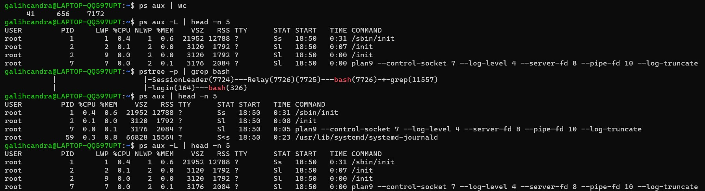

Jawaban:
1. Total proses yang berjalan adalah 41 proses, dan PID terkecil adalah 1, yaitu proses /sbin/init.
1. Proses bash memiliki induk (PPID) yaitu login dan Relay, tergantung dari proses bash yang diamati.
2. ps aux menampilkan proses saja, sedangkan ps aux -L menampilkan proses beserta thread, sehingga satu proses bisa muncul lebih dari satu baris.

## Praktikum 6.2 — Mengamati Siklus Hidup Proses
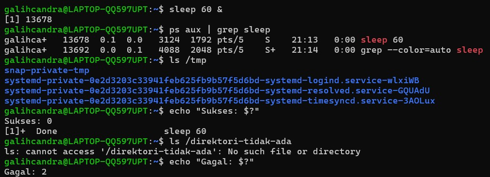

### Latihan 6.2
1. Jalankan sleep 120 & dan amati kolom STAT pada ps aux. Kondisi
apa yang ditampilkan? Mengapa proses sleep berada di kondisi tersebut?
1. Jalankan beberapa perintah yang berhasil dan yang gagal, lalu catat exit
code masing-masing. Pola apa yang Anda temukan?

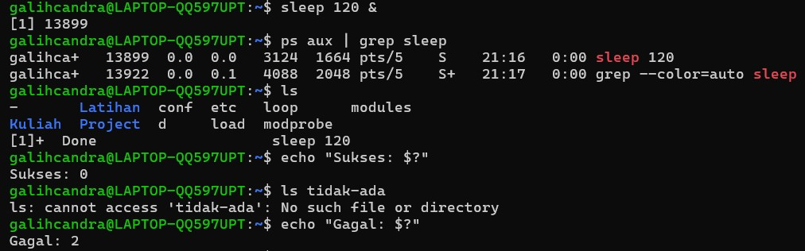
Jawaban:

1. Kondisi yang ditampilkan pada kolom STAT adalah S (sleeping).
Hal ini karena proses sleep sedang menunggu waktu (delay) tanpa melakukan aktivitas CPU, sehingga berada dalam kondisi tidur
2. Pola yang saya temukan adalah kode 0 jika berhasil, dan kode selain 0 jika tidak berhasil.

## Praktikum 6.3 — Mengatur Prioritas Proses
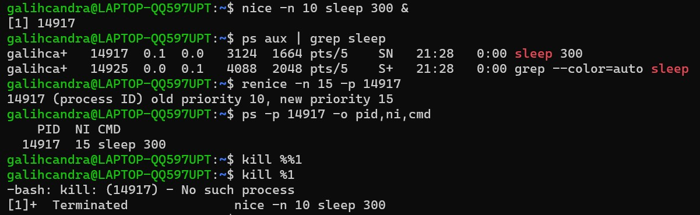

### Latihan 6.3
1. Jalankan nice -n 5 sleep 200 & dan verifikasi nilai NI-nya dengan
ps.
1. Ubah nilai nice menjadi 10 menggunakan renice, lalu verifikasi kembali.
2. Coba ubah nilai nice menjadi -5 tanpa sudo. Apa yang terjadi? Mengapa Linux membatasi hal ini untuk user biasa?

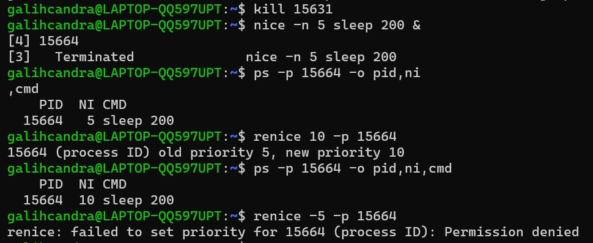

Jawaban:
1. Sudah tercantum pada gambar di atas.
2. Sudah tercantum pada gambar di atas.
3. Yang terjadi adalah permission failed karena user biasa di larang menaikkan prioritas demi kestablian sistem.

## Praktikum 6.4 — Mengirim Sinyal ke Proses
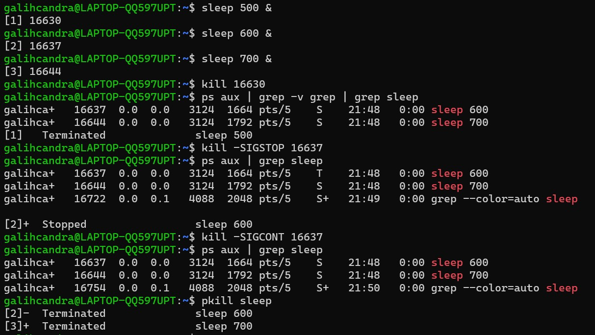

### Latihan 6.4
1. Jalankan sleep 400 &, kirim SIGSTOP, dan amati perubahan kolom
STAT. Kondisi apa yang muncul?
2. Kirim SIGCONT dan verifikasi proses kembali berjalan.
3. Hentikan proses dengan SIGTERM lalu verifikasi sudah tidak ada. Kapan
Anda memilih SIGKILL daripada SIGTERM?

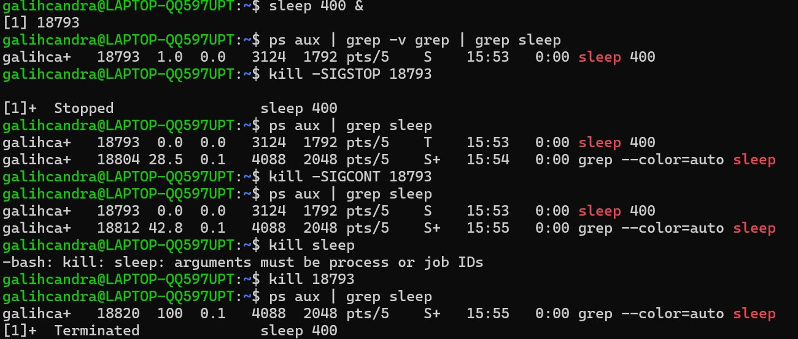

Jawaban:
1. Kondisi STAT yang awalnya adalah S berubah menjadi T (Stopped) setelah mengirim SIGSTOP.
2. Kondisi STATnya balik lagi ke S (terlampir di gambar).
3. Memilih SIGKILL jika proses tidak merespon SIGTERM.

## Praktikum 6.5 — Manajemen Job Foreground dan Background
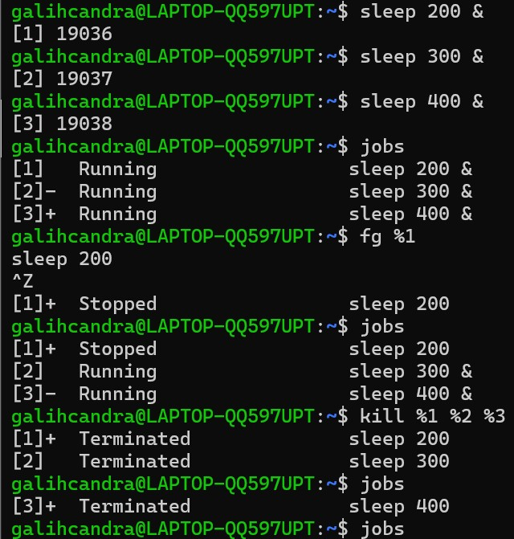

### Latihan 6.5
1. Jalankan top di foreground. Apa yang terjadi di terminal?
2. Tekan Ctrl+Z dan cek statusnya dengan jobs. Kondisi apa yang
ditampilkan?
3. Pindahkan ke background dengan bg. Apakah top dapat berjalan dengan
baik di background? Mengapa? Kembalikan ke foreground dengan fg, lalu keluar dengan q
   
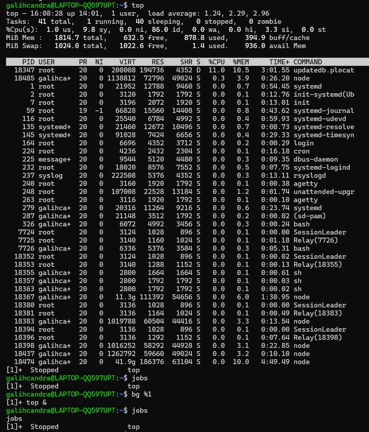

Jawaban:
1. Yang terjadi adalah terminal menampilkan monitoring proses secara real time.
2. Kondisi proses top terjeda karena CTRL+Z.
3. op tidak berjalan dengan baik di bg karena membutuhkan interaksi langsung dengan terminal (foreground) untuk menampilkan output secara real-time.
   