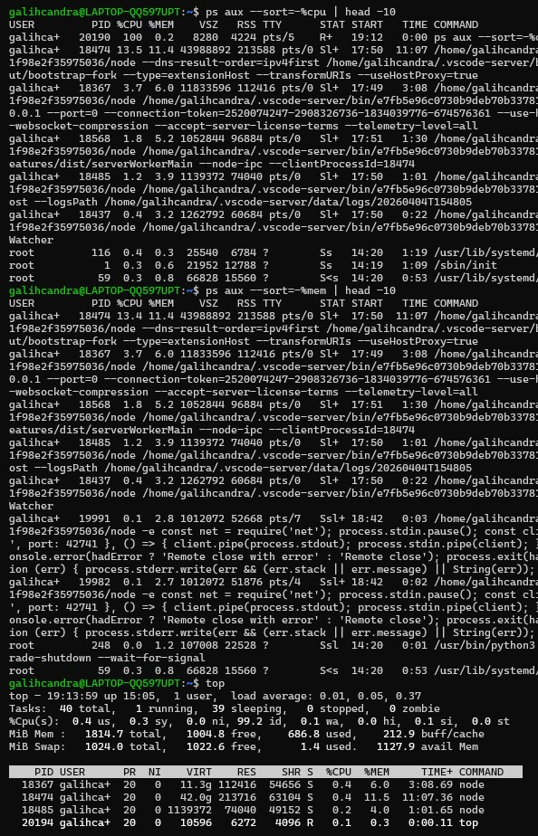
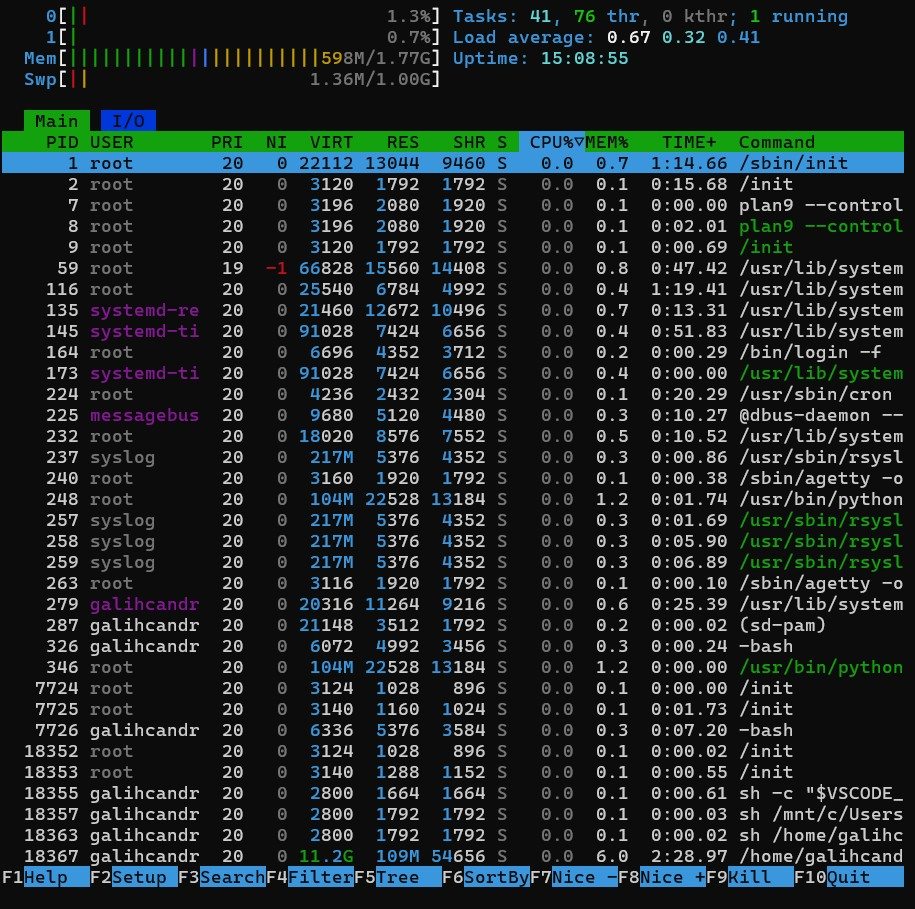
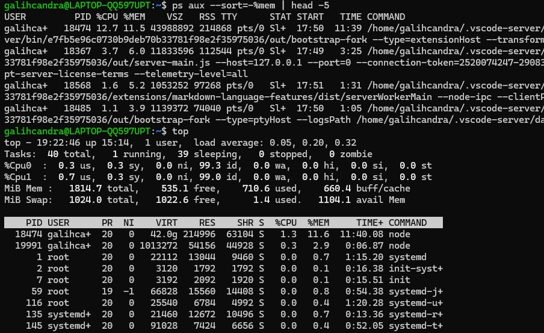
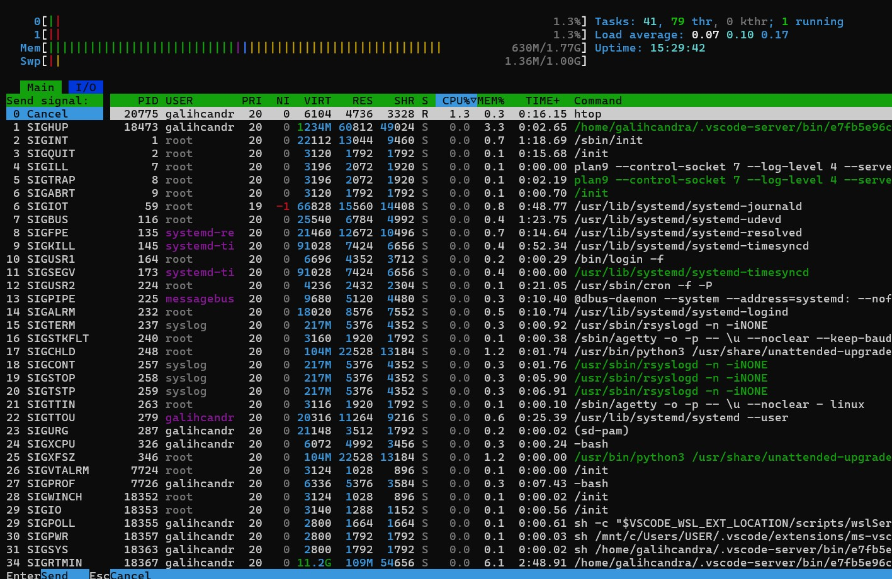
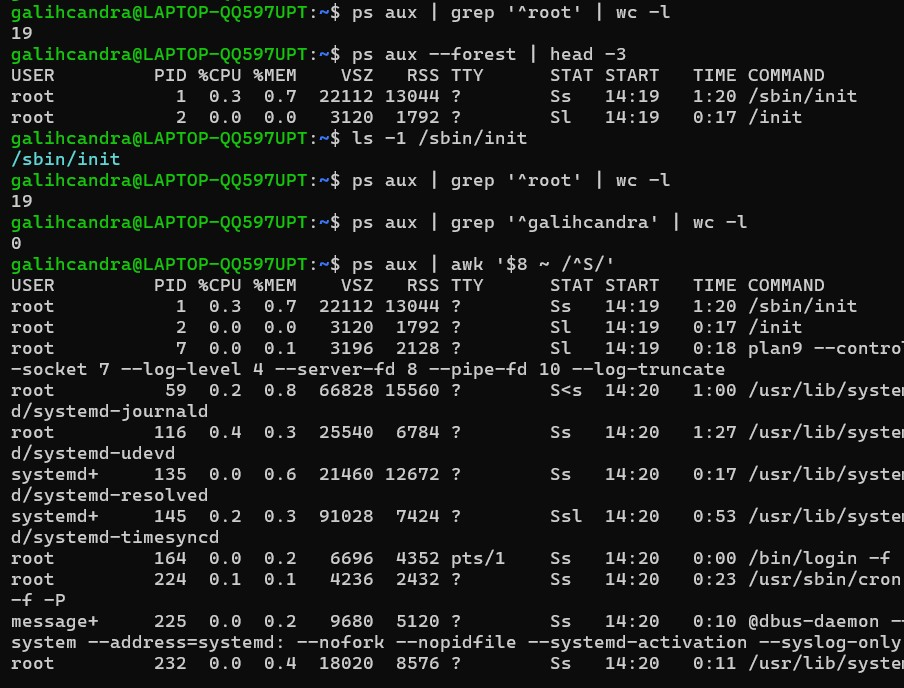
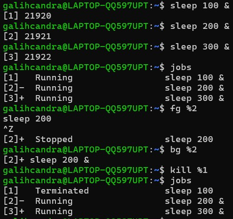
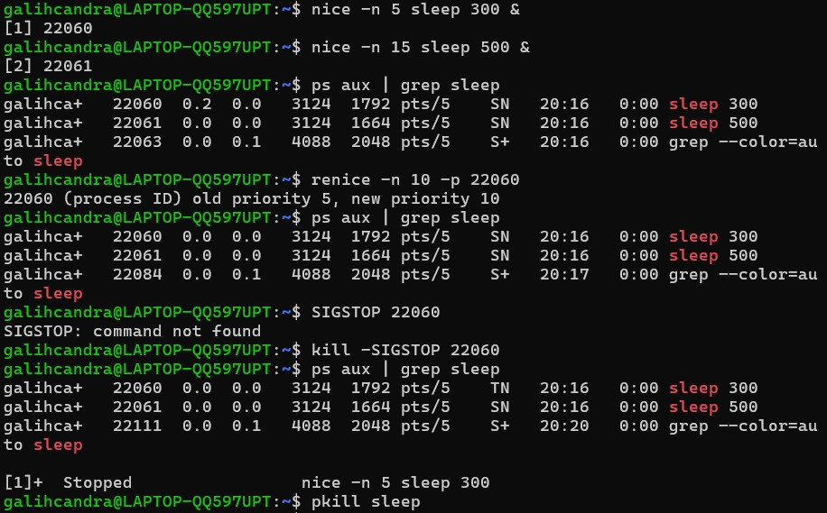

# LAPORAN JOBSHEET 6
Manajemen Proses

* Nama: Galih Candra Kirana
* NIM: 254107020080
* Kelas: TI-1G

## Praktikum 6.1 — Melihat Proses dan Thread


### Latihan 6.1
Jalankan ps aux dan amati outputnya:
1. Berapa total proses yang berjalan? Proses apa yang memiliki PID
terkecil?
2. Jalankan pstree -p dan temukan proses bash Anda. Proses apa yang
menjadi induk (PPID) dari bash tersebut?
3. Bandingkan output ps aux dan ps aux -L. Apa perbedaan yang Anda
lihat?


Jawaban:
1. Total proses yang berjalan adalah 41 proses, dan PID terkecil adalah 1, yaitu proses /sbin/init.
1. Proses bash memiliki induk (PPID) yaitu login dan Relay, tergantung dari proses bash yang diamati.
2. ps aux menampilkan proses saja, sedangkan ps aux -L menampilkan proses beserta thread, sehingga satu proses bisa muncul lebih dari satu baris.

## Praktikum 6.2 — Mengamati Siklus Hidup Proses


### Latihan 6.2
1. Jalankan sleep 120 & dan amati kolom STAT pada ps aux. Kondisi
apa yang ditampilkan? Mengapa proses sleep berada di kondisi tersebut?
1. Jalankan beberapa perintah yang berhasil dan yang gagal, lalu catat exit
code masing-masing. Pola apa yang Anda temukan?


Jawaban:

1. Kondisi yang ditampilkan pada kolom STAT adalah S (sleeping).
Hal ini karena proses sleep sedang menunggu waktu (delay) tanpa melakukan aktivitas CPU, sehingga berada dalam kondisi tidur
2. Pola yang saya temukan adalah kode 0 jika berhasil, dan kode selain 0 jika tidak berhasil.

## Praktikum 6.3 — Mengatur Prioritas Proses


### Latihan 6.3
1. Jalankan nice -n 5 sleep 200 & dan verifikasi nilai NI-nya dengan
ps.
1. Ubah nilai nice menjadi 10 menggunakan renice, lalu verifikasi kembali.
2. Coba ubah nilai nice menjadi -5 tanpa sudo. Apa yang terjadi? Mengapa Linux membatasi hal ini untuk user biasa?


Jawaban:
1. Sudah tercantum pada gambar di atas.
2. Sudah tercantum pada gambar di atas.
3. Yang terjadi adalah permission failed karena user biasa di larang menaikkan prioritas demi kestablian sistem.

## Praktikum 6.4 — Mengirim Sinyal ke Proses


### Latihan 6.4
1. Jalankan sleep 400 &, kirim SIGSTOP, dan amati perubahan kolom
STAT. Kondisi apa yang muncul?
2. Kirim SIGCONT dan verifikasi proses kembali berjalan.
3. Hentikan proses dengan SIGTERM lalu verifikasi sudah tidak ada. Kapan
Anda memilih SIGKILL daripada SIGTERM?


Jawaban:
1. Kondisi STAT yang awalnya adalah S berubah menjadi T (Stopped) setelah mengirim SIGSTOP.
2. Kondisi STATnya balik lagi ke S (terlampir di gambar).
3. Memilih SIGKILL jika proses tidak merespon SIGTERM.

## Praktikum 6.5 — Manajemen Job Foreground dan Background


### Latihan 6.5
1. Jalankan top di foreground. Apa yang terjadi di terminal?
2. Tekan Ctrl+Z dan cek statusnya dengan jobs. Kondisi apa yang
ditampilkan?
1. Pindahkan ke background dengan bg. Apakah top dapat berjalan dengan
baik di background? Mengapa? Kembalikan ke foreground dengan fg, lalu keluar dengan q
   


Jawaban:
1. Yang terjadi adalah terminal menampilkan monitoring proses secara real time.
2. Kondisi proses top terjeda karena CTRL+Z.
3. op tidak berjalan dengan baik di bg karena membutuhkan interaksi langsung dengan terminal (foreground) untuk menampilkan output secara real-time.
   
## Praktikum 6.6 — Pemantauan Proses



### Latihan 6.6
1. Gunakan ps aux –sort=%mem untuk menemukan proses yang menggunakan memori paling banyak di VM Anda. Proses apa itu?
2. Di dalam top, tekan 1 . Apa yang berubah pada tampilan? Mengapa
informasi ini berguna?
3. Di dalam htop, navigasikan ke proses sshd menggunakan tombol panah.
Tekan F9 dan amati opsi sinyal yang tersedia.




Jawaban: 
1. Proses yang menggunakan memori paling besar adalah
```bash
/home/galihcandra/.vscode-server/...
```
(dengan penggunaan sekitar 11.5% memori, PID 18474)
1. Tampilan berubah menjadi menampilkan penggunaan CPU per core (inti), bukan total CPU saja.
Hal ini berguna untuk melihat beban tiap core, sehingga bisa diketahui apakah ada core yang bekerja lebih berat dibanding yang lain.
1. Sudah terlampir di gambar tetapi bukan proses sshd karena tidak ada.

## Latihan
### Latihan 6.A
Eksplorasi Proses Sistem
1. Jalankan ps aux –forest dan temukan proses dengan PID 1. Apa
nama dan fungsi proses tersebut dalam sistem Linux modern?
2. Hitung berapa proses yang dimiliki oleh user root dan berapa yang
dimiliki oleh user Anda. Mengapa root memiliki lebih banyak proses?
3. Temukan semua proses yang berada dalam kondisi S. Mengapa sebagian
besar proses di sistem berada dalam kondisi ini?



Jawaban:
1. Nama proses dengan PID 1 pada sistem saya adalah /sbin/init. Proses ini berfungsi sebagai init system yang bertanggung jawab menginisialisasi sistem dan menjalankan proses lainnya. Namun, karena sistem berjalan di lingkungan WSL, init yang digunakan bukan systemd penuh, melainkan versi yang disesuaikan untuk integrasi dengan Windows.
2. Proses yang dimiliki oleh user root adalah 19, sedangkat user saya tidak ada(0). User root eenjalankan banyak proses karena root menjalankan service sistem, sedangkan user saya hanya menjalankan aktivitas user biasa. 
3. Sudah terlampir di gambar. Sebagian proses sistem dalam kondisi S karena sistem linux sedang tidak digunakan, contoh seperti terminal yang menunggu input.

### Latihan 6.B
Simulasi Manajemen Job
1. Jalankan tiga perintah sleep dengan durasi 100, 200, dan 300 detik di background. Verifikasi ketiganya dengan jobs.
2. Bawa job kedua ke foreground, jeda dengan Ctrl+Z , lalu kembalikan
ke background dengan bg.
3. Hentikan job pertama dengan kill %1. Tampilkan kembali daftar job.
Berapa job yang tersisa?



Jawaban: 
1. Terlampir di gambar.
2. Terlampir di gambar.
3. Job yang tersisa adalah 2 proses yang sedang berjalan.

### Latihan 6.C
Prioritas dan Sinyal
1. Jalankan dua proses sleep: satu dengan nice +5 dan satu dengan nice
+15. Verifikasi nilai NI keduanya dengan ps.
2. Gunakan renice untuk mengubah nice proses pertama menjadi +10.
Proses mana yang kini lebih diprioritaskan scheduler?
3. Kirim SIGSTOP ke salah satu proses, verifikasi kondisi T-nya, lalu kirim SIGCONT. Akhiri semua proses percobaan dengan pkill sleep.



Jawaban:
1. Terlampir di gambar.
2. Proses yang lebih diprioritaskan adalah proses dengan nice 10 karena lebih kecil dari proses nice 15.
3. Terlampir di gambar.
