# LAPORAN JOBSHEET 9
Pemrograman Bash

* Nama: Galih Candra Kirana
* NIM: 254107020080
* Kelas: TI-1G

## Praktikum 9.1 Script Pertama: Laporan Sistem
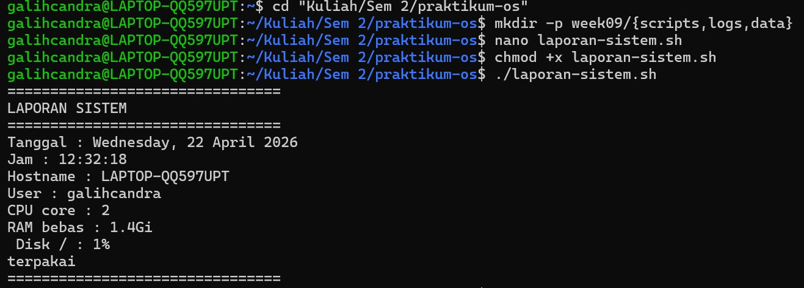

### Latihan 9.1
Modifikasi laporan-sistem.sh agar menyimpan output ke file
laporan-YYYY-MM-DD.txt sekaligus menampilkannya di terminal. Petunjuk:
gunakan tee yang sudah dipelajari di bab sebelumnya.

Jawaban
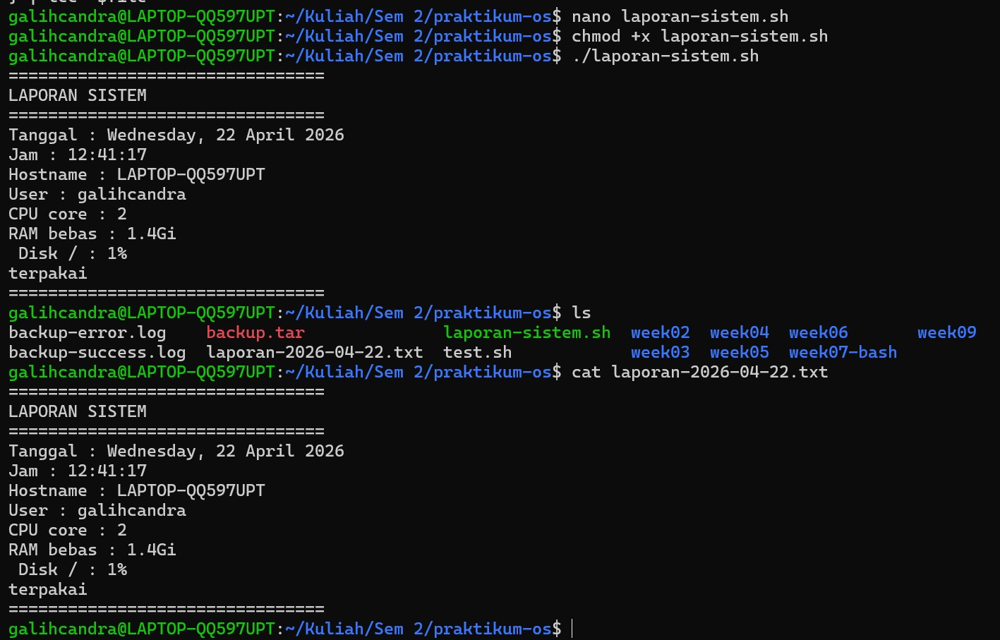

Script:
```bash
#!/bin/bash
# Script: laporan-sistem.sh

file="laporan-$(date +%Y-%m-%d).txt"

{
echo "================================"
echo "LAPORAN SISTEM"
echo "================================"
echo "Tanggal : $(date '+%A, %d %B %Y')"
echo "Jam : $(date '+%H:%M:%S')"
echo "Hostname : $(hostname)"
echo "User : $(whoami)"
echo "CPU core : $(nproc)"
echo "RAM bebas : $(free -h | awk '/^Mem/ {print $4}')"
echo " Disk / : $(df -h / | awk 'NR==2 {print $5}')
terpakai "
echo "================================"
} | tee "$file"
```

## Praktikum 9.2 Script Info Sistem dengan Argumen
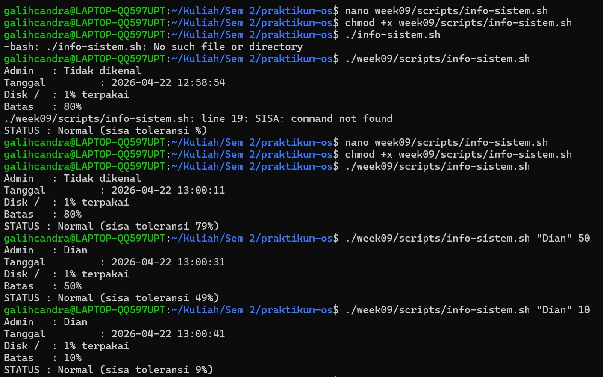

### Latihan 9.2
Buat script kalkulator.sh yang menerima tiga argumen: <angka1> <operator> <angka2> dengan operator +, -, *, atau /. Contoh:
./kalkulator.sh 20 + 5 menghasilkan 25. Gunakan case untuk memilih operasi, dan validasi jika argumen tidak lengkap.

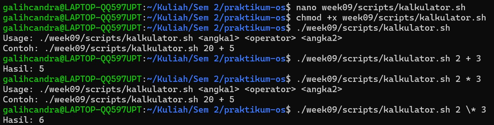

Script:
```bash
#!/bin/bash
# Penggunaan : ./kalkulator.sh [angka1] [operator] [angka2]

ANGKA1=${1}
OPERATOR=${2}
ANGKA2=${3}

# Validasi jumlah argumen
if [ $# -ne 3 ]; then
     echo "Usage: $0 <angka1> <operator> <angka2>"
     echo "Contoh: $0 20 + 5"
     exit 1
fi

case $OPERATOR in
     +)
        HASIL=$((ANGKA1 + ANGKA2))
        ;;
     -)
        HASIL=$((ANGKA1 - ANGKA2))
        ;;
     \*)
        HASIL=$((ANGKA1 * ANGKA2))
        ;;
     /)
        if [ "$ANGKA2" -eq 0 ]; then
          echo "Error: pembagian dengan nol tidak diperbolehkan"
          exit 1
        fi
        HASIL=$((ANGKA1 / ANGKA2))
        ;;
     *)
        echo "Operator tidak valid. Gunakan +, -, *, atau /"
        exit 1
        ;;
esac

echo "Hasil: $HASIL"
```

## Praktikum 9.3 Script Grading dan Menu Interaktif
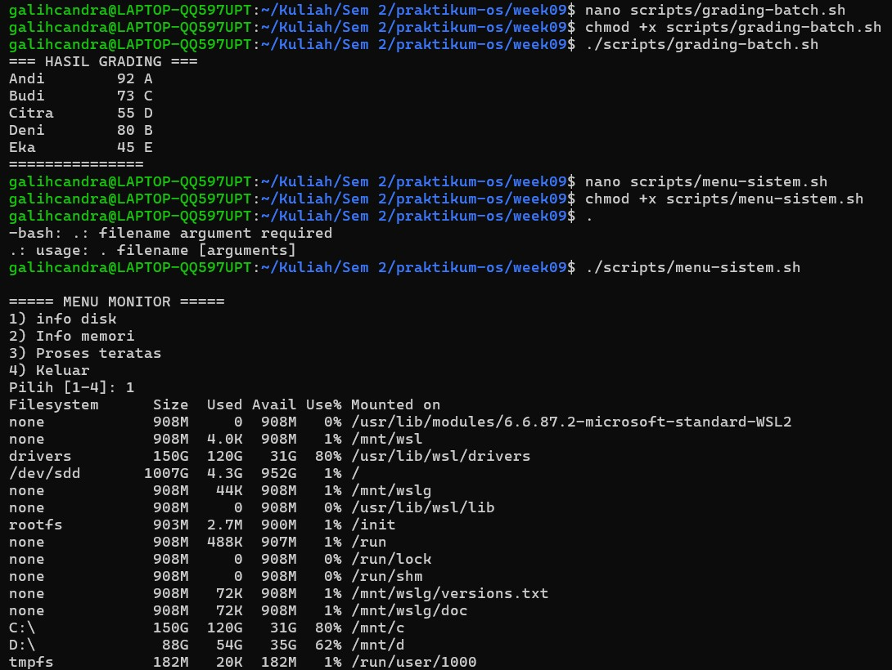
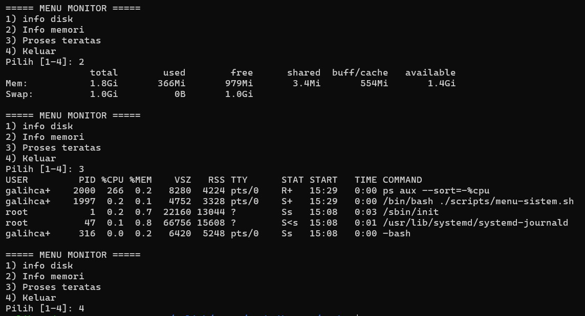

### Latihan 9.3
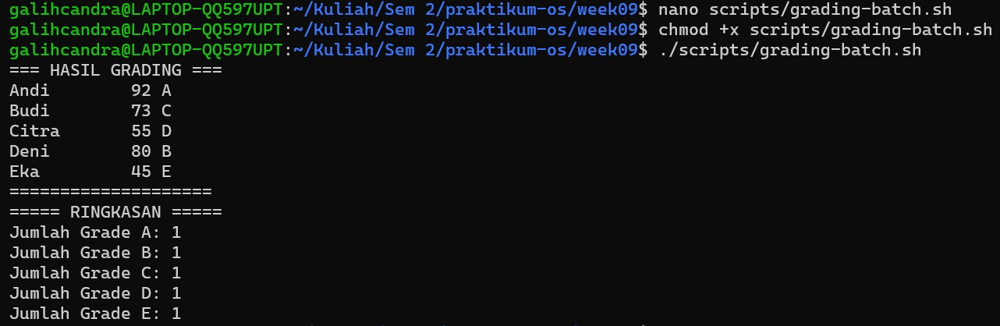

Script:
```bash
#!/bin/bash
# Script: grading-batch.sh
# Proses daftar nilai mahasiswa

MAHASISWA=("Andi:92" "Budi:73" "Citra:55" "Deni:80" "Eka:45")

echo "=== HASIL GRADING ==="

for i in "${!MAHASISWA[@]}"; do
    ENTRI=${MAHASISWA[$i]}

    NAMA=${ENTRI%%:*}
    NILAI=${ENTRI##*:}

    if [ "$NILAI" -ge 85 ]; then
        GRADE="A"
    elif [ "$NILAI" -ge 75 ]; then
        GRADE="B"
    elif [ "$NILAI" -ge 65 ]; then
        GRADE="C"
    elif [ "$NILAI" -ge 55 ]; then
        GRADE="D"
    else
        GRADE="E"
    fi

    MAHASISWA[$i]="$NAMA:$NILAI:$GRADE"

    printf "%-10s %3d %s\n" "$NAMA" "$NILAI" "$GRADE"
done

echo "===================="

A=0; B=0; C=0; D=0; E=0

for ENTRI in "${MAHASISWA[@]}"; do
    GRADE=$(echo "$ENTRI" | cut -d: -f3)

    case $GRADE in
        A) ((A++)) ;;
        B) ((B++)) ;;
        C) ((C++)) ;;
        D) ((D++)) ;;
        E) ((E++)) ;;
    esac
done

echo "===== RINGKASAN ====="
echo "Jumlah Grade A: $A"
echo "Jumlah Grade B: $B"
echo "Jumlah Grade C: $C"
echo "Jumlah Grade D: $D"
echo "Jumlah Grade E: $E"
```

## Praktikum 9.4 Library Fungsi Validasi
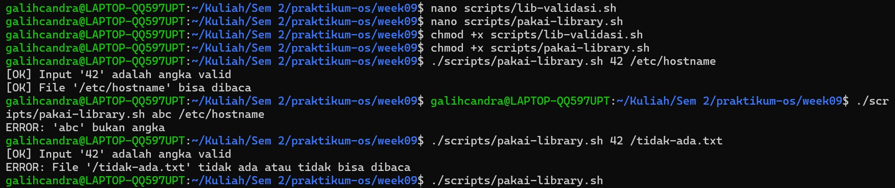

### Latihan 9.4
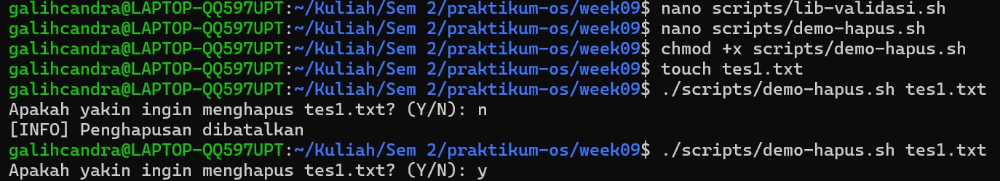
Scripts:
```bash
lib-validasi.sh
#!/bin/bash

# lib-validasi.sh

adalah_angka() {
    [[ "$1" =~ ^[0-9]+$ ]]
}

file_bisa_dibaca() {
    [ -f "$1" ] && [ -r "$1" ]
}

error_exit() {
    echo "ERROR: $1" >&2
    exit 1
}

info() {
    echo "[INFO] $1"
}

sukses() {
    echo "[OK] $1"
}

konfirmasi() {
    read -p "$1 (Y/N): " jawab

    case "$jawab" in
      Y|y) return 0 ;;
        N|n) return 1 ;;
        *) echo "Input harus Y atau N"
           return 1 ;;
    esac
}
```

```bash
demo-hapus.sh
#!/bin/bash

source "$(dirname "$0")/lib-validasi.sh"

FILE=$1

[ -z "$FILE" ] && error_exit "Penggunaan: $0 <nama-file>"

if [ ! -f "$FILE" ]; then
    error_exit "File tidak ditemukan"
fi

if konfirmasi "Apakah yakin ingin menghapus $FILE?"; then
    rm "$FILE"
    sukses "File berhasil dihapus"
else
    info "Penghapusan dibatalkan"
fi
```

## Praktikum 9.5 Script Backup dengan Opsi
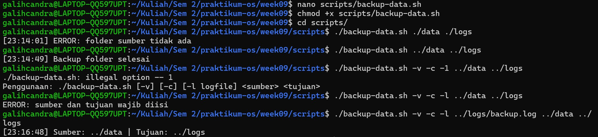


## Praktikum 9.6 Debugging Script
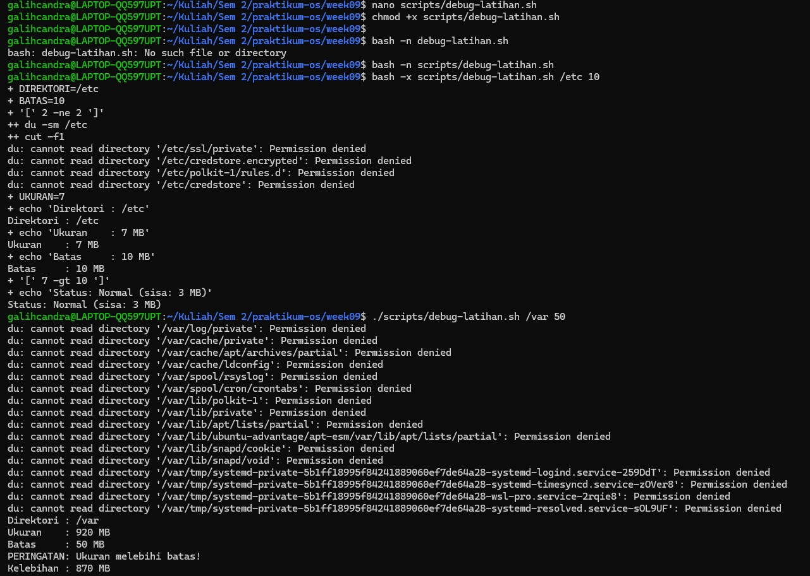

### Latihan 9.4
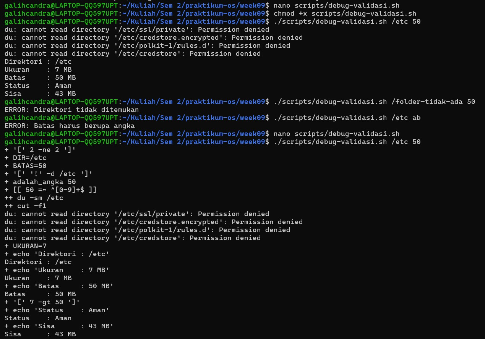
Scripts:
```bash

```

## Tugas Praktikum